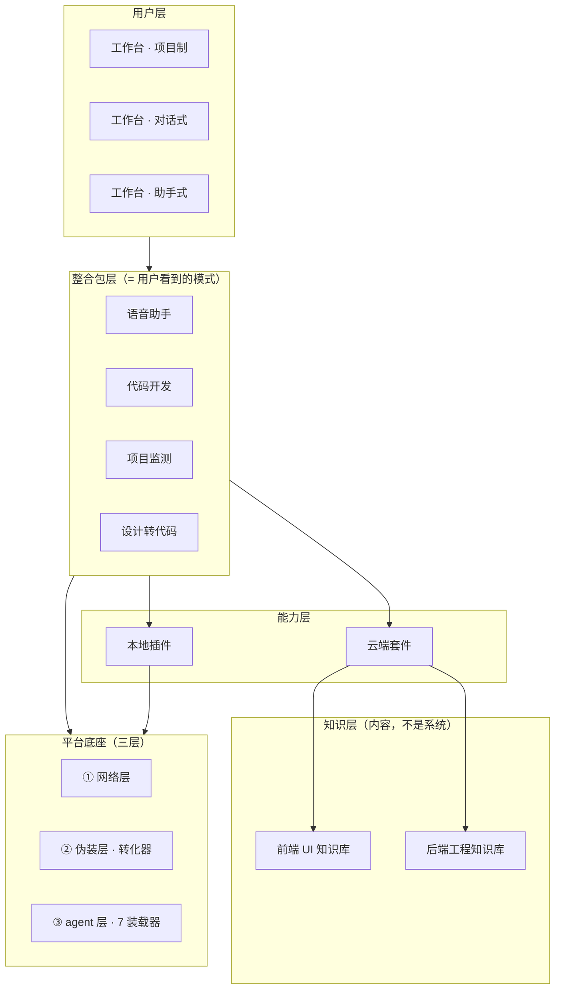
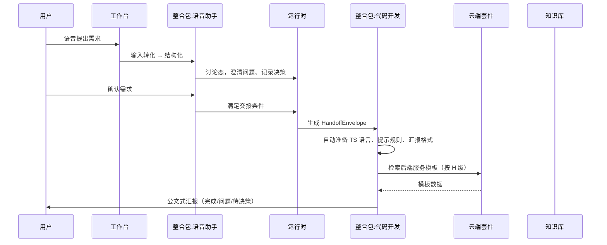

# 01 · 系统全景

> 本文是整套开发文档的入口图。系统按**完整形态一次性交付**，不存在"先做一部分"的分期取舍。

## 1. 一句话定义

一个**主核心单薄、其余皆为插件**的 Agent 平台：底座只负责装载、路由、记录；用户看到的"模式"由整合包提供；能力来自本地插件和云端套件；模式之间可以时空衔接。

## 2. 分层全景

**读法**：底座最薄（三个装载器层），知识库只是内容（不进运行时），整合包是用户唯一直接操作的对象。

## 3. 六个组成部分

| 部分 | 是什么 | 不是什么 | 详见 |
|---|---|---|---|
| **平台底座** | 网络层 + 伪装层 + agent 层，三个装载器层 | 不含任何业务逻辑 | [02](02-平台底座-后端底层架构.md) |
| **装载器** | skill / 工具 / MCP / 工作流 / 文件 / 输入转化器 / A2A 规定 | 不是能力本身，是能力的挂载点 | [03](03-装载器与a2a规范.md) |
| **三大核心对象** | 套件（云端）/ 插件（本地）/ 整合包（模式） | 插件不决定流程，整合包不实现能力 | [04](04-三大核心对象.md) |
| **云端套件** | 本地插件（可视化嵌入）+ 云端后端端口（提供数据） | 不是单点服务，是双体结构 | [05](05-云端套件双体结构.md) |
| **模式衔接** | 时空衔接 + `HandoffEnvelope` 交接协议 | 不是重启，是带上下文换执行环境 | [06](06-模式衔接与交接协议.md) |
| **知识库** | 前端 UI 知识库 + 后端工程知识库 | **不是这个 Agent 系统**，是被检索的内容 | [07](07-前端UI知识库.md) / [08](08-后端工程知识库.md) |

## 4. 一次典型的完整流程

以"语音助手 → 代码开发"为例，贯穿全部层：

## 5. 三条贯穿全系统的设计律

### 5.1 主核心单薄

底座不含业务。所有业务能力都在插件和套件里。判断某段逻辑该放哪：

- 放底座 → 换模式也要用它
- 放插件 → 只有部分模式用它，且是本地能力
- 放套件 → 需要云端数据或需要跨用户共享
- 放整合包 → 只有某个模式用它，且是编排规则

权威表述与完整判据表见 [11 §1.1](11-设计理念与硬性约束.md)。

**真正管用的验证只有一条：拿掉它，系统还能不能启动？** 上面的判据是这条验证的速记版，不是它本身。「有没有模式用它」会给出错误答案，所以写死两个例外：

| 例外 | 为什么判据对它失效 | 归属 |
|---|---|---|
| `i18n`（多语言） | **所有模式都用**，判据第一条直接不成立。但拿掉它，全库回退源语言（＝不翻译），系统照常跑 | 插件 |
| 账号（多模型） | **所有模式都用**，同上。拿掉它，工具能力照常，只是调不了模型 | 核心（见 [02 §5.2](02-平台底座-后端底层架构.md)） |

这两个不是同一种情况，别照抄：账号是模型的公共依赖，**没有它系统就真的跑不起来**，所以它在核心；i18n 拿掉只损失一层翻译，**系统完全跑得起来**，所以它是插件。**判据问的是"拿掉会不会坏"，不是"有没有人用"。**

同理，[session-hub](../插件/协作/session-hub/开发文档.md) 放插件也是同一个理由：拿掉它系统照常跑，只是退回单会话。会话**容器**在核心里（每条消息都要落到某个会话里），派活和跨会话读在插件里。

### 5.2 全部内容只提供接口

包括转化器在内的所有工具都允许替换。详见 [02 §1](02-平台底座-后端底层架构.md)。

### 5.3 自举重加载

插件在依赖上加载，插件崩溃不带崩程序。装载器契约详见 [03](03-装载器与a2a规范.md)。

## 6. 一次性交付的完整范围

系统整体一次性做完整，不按 H 级分期。完整范围包含：

| 域 | 交付内容 | 详见 |
|---|---|---|
| 底座 | 网络层、伪装层、agent 层全部实现 | [02](02-平台底座-后端底层架构.md) |
| 装载 | 7 个装载器 + A2A 规定 | [03](03-装载器与a2a规范.md) |
| 对象模型 | 套件/插件/整合包三套清单与注册表 | [04](04-三大核心对象.md) |
| 套件 | 双体结构（本地可视化插件 + 云端端口） | [05](05-云端套件双体结构.md) |
| 衔接 | 时空衔接协议 + 交接契约 | [06](06-模式衔接与交接协议.md) |
| 前端知识 | 组件/Token/素材/设计即代码 | [07](07-前端UI知识库.md) |
| 后端知识 | 服务模板/微服务/多语言适配/**H1–H5 等级** | [08](08-后端工程知识库.md) |
| AI 能力 | 循环、三层结构、多 Agent 协同、TDD/IDD | [09](09-AI能力蓝图.md) |
| 工作台 | 项目制/对话式/助手式 + 过程性展示 | [10](10-工作台与项目管理.md) |
| 契约 | 全部 TypeScript 类型定义 | [12](12-TypeScript接口契约.md) |

> **H1–H5 的定位**：不是本系统的交付阶段，而是**云端后端开发知识库的等级标注系统**，是云端套件的内容分级。见 [08 §4](08-后端工程知识库.md)。

## 7. 语言与技术栈

- **平台底座、运行时、装载器、契约**：TypeScript
- **前端开发辅助目标**：Web + React + TypeScript
- **后端知识库语言适配**：Java / Go / Rust / Python 为可插拔适配方向
- **全部能力只暴露接口**，不绑定任何模型供应商或云服务

## 8. 相关文档

- [README](README.md) — 文件清单与阅读顺序
- [11-设计理念与硬性约束](11-设计理念与硬性约束.md) — 8 条设计理念 + 4 条功能约束
- [04-三大核心对象](04-三大核心对象.md) — 术语权威定义
