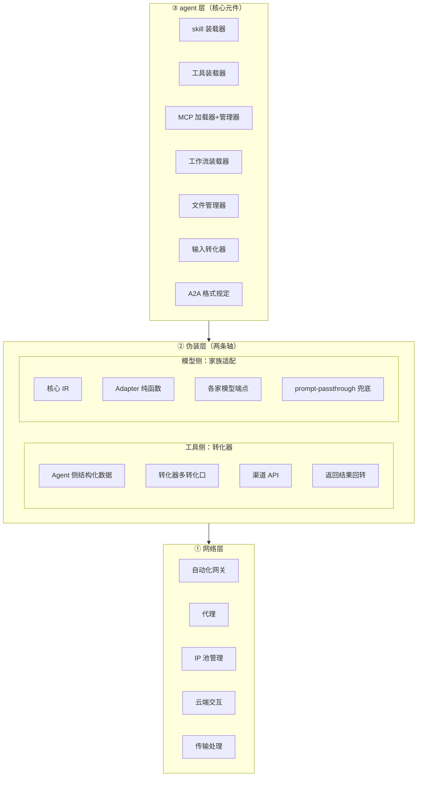
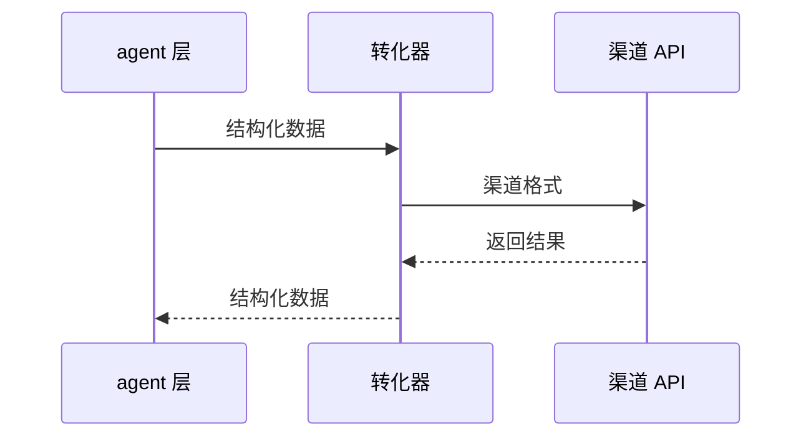

# 02 · 平台底座：后端底层架构

> 原始图：[图/01-平台后端底层架构.png](图/01-平台后端底层架构.png)
> 层级归属：Agent 平台自身的底座，**不属于**任何知识库，也不属于任何套件。

## 1. 顶层原则

> **全部内容都只提供接口，包括转化器等工具均允许替换。**

这是整个底座的唯一硬约束，推导出三条规则：

1. **一切皆接口**。网络、伪装、agent 三层之间只通过接口通信，不持有对方的实现引用。
2. **实现可替换**。任何一层、任何一个转化器、任何一份清单，都必须能被替换而不影响上层。
3. **可替换 = 可灰度**。替换走适配器注册，不走代码分支，因此可以按请求粒度切换实现。
4. **可兜底 = 可用**。适配器全部拿掉，系统仍要能用 —— 裸核自带 passthrough，没有"必须先装适配器"这种东西。

底座自身被压到最薄，只做三件事：**装载、路由、记录**。所有业务能力都在插件和套件里。

## 2. 三层结构



三层是**自上而下**的调用关系：agent 层产生结构化数据，伪装层把它转成外部能吃的格式，网络层负责把它送出去并把结果带回来。

伪装层内部有**两条互不依赖的轴**：工具侧（agent 工具调用 → 渠道 API）与模型侧（核心结构 → 各家模型端点）。详见 [§4](#4-②-伪装层)。

## 3. ① 网络层

| 子模块 | 职责 | 具体能力 |
|---|---|---|
| 自动化网关 | 出网统一入口 | ① 局域网（墙）内自闭环；② 流量区分 → 分流到他区，供应商支持直连/中转 |
| 代理 | 出口保持 | ① AI 缓存命中；② 供应商切换 / 请求头切换 |
| IP 池管理 | 出口身份稳定 | ① IP 池自动代理；② IP 区域锁定（防突然跳 IP 封号） |
| 云端 | 跨端协同 | ① 执行指令和执行端交互；② 团队协同交互 |
| 传输处理 | 载荷净化 | ① 内容优化（AI + 正则）；② 内容清洗 |

### 3.1 关键设计点

- **局域网（墙）内自闭环**：出网请求默认不离开机构内网，云端套件走内网端口。
- **流量区分 → 他区**：按流量特征决定留在本区还是转出，转出时供应商可配直连或中转。分区决策是数据驱动的，不是硬编码。
- **IP 区域锁定**：同一请求/任务在生命周期内锁定 IP 区域，避免出口漂移触发风控。
- **传输处理是可插拔的净化层**：`内容优化（AI + 正则）` 与 `内容清洗` 是两件事，AI 做语义层，正则做结构层，二者串联。清洗规则来自整合包的 `promptPolicy`。

### 3.2 网关透射性（对模型调用路径的硬要求）

> **这一节是给我们自己网关的要求，不是给第三方的。**

网关是每个请求必经的一层。它一旦重写 payload，下面三个**都不报错**，只是结果不对：

| # | 症状 | 为什么不报错 |
|---|---|---|
| 推理静默消失 | 仍返回 200，内容少一块 | 少字段不是协议错误 |
| **账单翻倍** | 缓存断点没了，多花几倍 token | 少命中不报错 |
| 工具结果全错位 | 流式正常，内容"看起来"合理 | 配对错位不报错 |

**这个风险对所有中间层一视同仁** —— 第三方中转、平台自己的网关、任何中间代理。所以防护不能挂在"这个端点可不可信"上，只能挂在**这一层不做多余动作**上。

三条硬要求：

| # | 要求 | 违反的症状 |
|---|---|---|
| 1 | **不重写请求体** —— 不注入 system、不改 `max_tokens`、不重排 messages | 推理块丢、工具配对错位 |
| 2 | **不缓冲流式响应** | 流式变非流式，前端体验崩 |
| 3 | **请求头只按白名单改**（trace id、UA） | 静默改 UA 可能触发风控 |

**契约测试**（四条，缺一不可）：

1. 带 `thinking` + `signature` 的请求过网关，断言出去时 signature **字节相同**
2. 带 `cache_control` 的，断言标记还在**原来的 block index** 上
3. `tool_use` + 紧邻 `tool_result`，断言顺序与嵌套未变
4. 流式请求，断言**首字节到达时间 ≪ 完整响应时间**（证明没缓冲）

第 4 条是唯一能证伪「偷偷缓冲」的方式，前三条证伪「偷偷重写」。四条都写成可执行断言，不是"要保证透传"这种无法验收的话。

> **注意这里的中转和账号的 `kind` 不是一回事。** `SuiteEndpoint.route: "relay"`（[05 §6](05-云端套件双体结构.md)）说的是**平台自己的转发节点**；`ModelAccount.kind: "relay"` 说的是**第三方中转站**。两者没有继承关系，本节管的是前者。

## 4. ② 伪装层

> 协议落差消解。**两条轴，各管各的。**

伪装层解决的是同一类问题的两个不同实例 —— **内部是统一结构，外部各要各的格式**。但两条轴的落差对象不同，契约也不同，**不能合并**：

| 轴 | 落差 | 契约 | 详见 |
|---|---|---|---|
| **工具侧** | agent 的工具调用 → 渠道 API | `Transformer` | §4.1 |
| **模型侧** | 核心内部结构 → 各家模型端点 | `Adapter` | §4.2 |

两条轴**互不依赖**：模型侧不可用不影响工具渠道，工具渠道不可用不影响模型调用。

### 4.1 工具侧：转化器

> Agent 调用工具（通用能力 / 渠道亲和）转化，多转化口（自助适应）



转化器是**多转化口**的：同一个结构化数据可以流向多个渠道，转化器自己判断该走哪个口。

```ts
interface Transformer {
  id: string;
  version: string;
  /** 该转化器支持的目标渠道 */
  channels: string[];
  /** 结构化数据 → 渠道请求体 */
  outbound(input: StructuredData, channel: string): OutboundPayload;
  /** 渠道响应 → 结构化数据 */
  inbound(payload: OutboundPayload, channel: string): StructuredData;
}
```

- **可替换**：转化器是注册表条目，`channels` 决定它能接哪个渠道，换一个转化器不影响 agent 层。
- **自助适应**：渠道新增/变更时只增加转化器，不改 agent 层任何代码。
- **渠道亲和**：同一能力在不同渠道有不同实现时，按亲和度选择转化器，而不是硬编码供应商。

### 4.2 模型侧：家族适配

> 同一份提示词和工具声明，喂给不同家模型，**格式和约定都不一样**。

这条轴和工具侧常被混为一谈，但它的三个特征决定了必须分开：**双向**（响应也要适配回来）、**会漂移**（约定随模型版本变）、**错了不报错**（只是质量下降）。

#### 4.2.1 边界的判定

| | 核心持有 | 插件提供 |
|---|---|---|
| IR（规范化中间表示）定义 | ✅ | |
| `Adapter` 接口 | ✅ | |
| `prompt-passthrough` 兜底 | ✅ 裸核自带 | |
| 协议细节（工具配对、流式、token、错误） | | ✅ |
| 模型家族适配（Claude / OpenAI / …） | | ✅ |
| 外部 agent CLI 接进来 | | ✅ |
| 中转站名录与体检 | | ✅ `relay-hub` |
| CLI 读哪份配置（检测注入 + 注入） | | ✅ `cli-profile` |

**为什么兜底归核心**：裸核 + 任何端点都得能跑。多数端点 OpenAI 兼容，一个 passthrough 默认实现就够，核心不该为空转。

**为什么家族适配归插件**：换家族要能独立装、独立关。**关掉 Claude 适配不该影响 OpenAI 适配。**

#### 4.2.2 契约：双向、纯函数、无 IO

```ts
interface Adapter {
  /** 覆盖的 model id 区间 */
  models: { exact?: string[]; range?: { min: string; max: string } }[];
  /** 厂商格式 → IR */
  toIR(raw: Raw): Canonical;
  /** IR → 厂商格式 */
  fromIR(canonical: Canonical): Raw;

  supports(modelId: string): boolean;
}
```

| 要求 | 为什么 |
|---|---|
| **双向** | 响应也要适配回来，不只出方向 |
| **纯函数、无 IO** | 可单测 —— 适配错误在测试里暴露，不在生产里 |
| **未知字段透传不丢** | 适配器吞字段 = 静默丢信息 |
| **有损字段标出来** | 往返转换后能知道丢了什么 |
| **不看账号类型** | 按账号分流是假防护，见下 |

**没有 IR 会怎样**：3 个模型 × 5 个端点 = 15 套对接。有了 IR，是 3 + 5 = 8 个方向。

#### 4.2.3 版本必须钉死；账号不参与选择

```text
model id → adapter-registry.select()
   命中、版本在区间内 → 用家族适配器
   命中但版本超区间   → 该适配器主动拒绝，走兜底
   没命中             → prompt-passthrough，记入埋点
```

**轴是模型家族 + 版本，不是模型名，更不是账号。** 厂商是分发商不是差异来源；同一厂商不同版本的约定会变。

**账号不参与选择** —— 这条容易被当成漏改，所以说明白。

账号的 `kind: "official" | "relay"` 决定的是**怎么到达**：官方直连 API 就到得了；中转要先把配置注入到外部 CLI，那份 CLI 才读得到（[§4.2.5.1](#4251-到外部-cli注入检测)）。它和「按什么格式调」是两件事。

曾经设计过「中转账号不许套家族适配器」，理由是中转可能不原样回传推理块、不认 `cache_control`、工具语义有偏差。**这个闸防不住任何东西**：

| 中转实际做了什么 | 症状 | 报不报错 |
|---|---|---|
| 自己改模型名 | 端点 404 | 报错 |
| 不原样回传 `thinking` 块 | 推理静默消失，质量下降 | **不报** |
| 不认 `cache_control` | **账单翻倍** | **不报** |
| 号称 OpenAI 兼容但 `tool` 语义不同 | 工具结果全错位 | **不报** |

后三条对**平台自己的网关**（[§3.2](#32-网关透射性对模型调用路径的硬要求)，每个请求都过它）、对任何中间代理**一视同仁**。按账号类型分流防不住它们中的任何一个，只会给「中转已经被处理过了」一个错觉。

真正的防护只有两处：**网关透射性契约**（§3.2）和**有损字段显式标出 + 埋点可审**。中转站那边能查的是 `RelayHub.probe()` 的连通性——那是**可用性**检查，不是**行为**检查。

**永远不阻断。** 兜底是底线，不是降级。

`prompt-passthrough` 还有个反向用途：**兜底占比过高是「该补适配器」的信号**，直接从埋点里读。

#### 4.2.4 三个静默翻车点

这三条搞错了**都不报错，只是结果不对**。这是适配层真正的价值所在。

| # | 坑 | 症状 | 处理 |
|---|---|---|---|
| 1 | **工具调用配对语义**。Anthropic 的 `tool_result` 必须紧邻 `tool_use`；OpenAI 的 `tool` 是独立 message | 表面还在跑，工具结果全错位 | `adapter-toolcall` 配对失败**拒绝该轮**，不带着错状态继续 |
| 2 | **推理块回传**。Anthropic 的 `thinking` 必须原样回传；OpenAI 系各家 reasoning 字段名不同 | 推理静默消失，回答质量下降但不崩 | 字段不认得时**原样透传，绝不丢，绝不猜** |
| 3 | **缓存断点**。Anthropic 要显式标 `cache_control`，位置错则完全不命中；OpenAI 系自动缓存 | **账单** —— 多花几倍 token | 放不下就放弃缓存，**明确告知这次没缓存** |

#### 4.2.5 外部 agent CLI

除了调各家模型端点，还可以**把别人已经调好的 agent CLI 当子进程跑** —— 它们自带 agent 循环、文件访问、工具链。

| 适合 | 不适合 |
|---|---|
| 复杂长任务，它那套 harness 已调好 | 需要精细控制每一步 |
| 一次性委派，只要结果 | 要全程埋点、每步可追溯 |
| 隔离工作区里的脏活 | 接触用户标注为敏感的数据目录 |

**代价**：黑盒、难埋点、结果回流要解析。

**走 API 还是走 CLI** 由模型名自动匹配或人工选定，解析链固定：

```text
① 显式指定（人指定的，永不被覆盖）
② 整合包 profile 声明
③ 粘性（人上次选过）
④ 自动匹配模型名（每次都告知，不默默跑外部程序）
⑤ API 兜底
```

**模型名匹配是便利，不是同一性** —— 键名带 `claude-` 前缀不代表认证兼容，第三方中转站的 key 会匹配上但起不来。因此：匹配上还要 `accepts(account)` 复核，不接受**回落 API**。每级都能用 `explain()` 说出为什么。

##### 4.2.5.1 到外部 CLI：注入检测

**完整流程**：中转站是别人的 → 在程序中选模型 → 询问时**检测注入情况，没用才注入** → 用 CLI → 完成后返回。

CLI 有自己的认证模型，它不认"平台传给我的 baseUrl + key"。要走中转站，就得**让 CLI 自己读到那份配置** —— ccswitch 干的同一件事，但检测优先：

```text
detect(cli, account) → absent | matching | mismatched | partial
     ↓
ensure()  ── matching ──→ 一个字节都不写，直接开跑
         └─ 其余 ──────→ 注入，走 A 或 B
```

**`matching` 是检测的全部价值**。CLI 会话要反复用同一份配置，每次重写既慢，又把配置暴露在"被外部改动"的窗口里。

**判据只取三项**（`baseUrl` / `keyHash` / `model`）—— 因为配置格式会变。解析器一旦要读懂整个文件，它就成了新的版本敏感点。窄抽取（只认这三个键的位置）能扛格式漂移，看不懂的部分原样留着。

**检测要能比 key，所以注入链的底座是凭据链**。`keyHash` 存 sha256 不存明文，指纹因此可以进埋点、可以事后审「这次到底用的哪把 key」。

| | A 环境变量隔离 | B 备份改写恢复 |
|---|---|---|
| 做法 | 起进程时把配置目录指到我们造的那份 | 改用户真配置，跑完改回来 |
| 动用户的东西 | **一点不动** | 动了 |
| 崩了的后果 | 临时目录留下，无影响 | **配置卡在中转态** |
| 并发 | 能 | **不能**，要抢锁 |
| ccswitch 用哪种 | — | B |

**默认 A，B 是降级。** ccswitch 选 B 合理 —— 它是手动点的小工具，进程在用户手里。**我们嵌在 agent 里跑长任务，随时可能被 kill**，B 那行"崩了"会真的发生，且是这类工具最难查的故障：用户下次打开官方 CLI，突然发现它在走中转。

B 的四个坑：写完不生效（**先写后 spawn**）、恢复不保证发生（**备份落固定路径，下次启动 `recoverOrphans()` 查残留**，不指望 `exit` handler）、并发互踩（**拿不到锁就回落 A，不排队**）、恢复失败静默（**比对哈希，对不上明确告警**）。

**CLI 会话把 B 排除了**（见下）。`partial` 单列，因为处理方式和 `mismatched` 不同：缺字段要补，多余的**不删**——可能别人的东西。

##### 4.2.5.2 CLI 会话与结果

外部 CLI 的启动成本（拉进程、建 agent 循环、灌上下文）在多次询问里摊薄得很快，所以会话是常驻的。

| | 行为 |
|---|---|
| **空闲自退** | 默认 5 分钟无 `ask` 就优雅退出，`exitReason: "idle-timeout"`。**不是可选项** —— 没有自退的 CLI 会话等于常驻泄漏 |
| **重建** | 带 `resumeToken` 重新 `openSession`，接上同一份 CLI 上下文 |
| **切绑定** | 老会话**跑完为止**，等它退到 `dead`，新会话才带 `resumeToken` 接管。**不打断正在跑的那一问** |
| **方式 B** | **CLI 会话禁用** —— 用户真配置会在整个 CLI 会话期间停在别的站上。降级要明确说出口，不悄悄换 |

**结果不截断。** `CliResult.raw` 是全量原文。

**格式要求前置传进 CLI**，不是拿到再裁：让 CLI 第一次就生成对的，比裁更省也更准 —— 裁剪只能删，生成能重排。格式来自整合包的 `profile.reportFormat`。

**超长不自动裁，交给人或者交给子智能体。** `cli-bridge` 只如实报 `digest: { reason, bytes }`，**自己不裁、不起子智能体** —— 那是 A2A 的事。具体摘要由整合包在 workflow 层接。`raw` 永远完整进埋点，哪怕被总结了：外部 CLI 的输出是模型路径的一环，裁掉就断链。

**三条硬约束**：

1. **它也在模型路径上** —— 每次调用必须记入埋点，否则「模型路径可追踪」就漏了一块。
2. **隔离不是可选项** —— 它是外部程序。`cli-sandbox` 隔离不可用时**直接拒绝启动**，不降级裸跑。
3. **自动匹配到 CLI 每次都告知** —— 外部程序在跑，人有权知道。

自动匹配可以在**账号或整合包层面整体关掉**，不是按等级开关。关掉后只允许人工选，且默认走 API。

#### 4.2.6 落地

19 个插件，见 [../插件/适配/README.md](../插件/适配/README.md)。

| 层 | 插件 |
|---|---|
| 协议（6） | `adapter-registry`、`adapter-ir`、`adapter-toolcall`、`adapter-stream`、`adapter-error`、`adapter-token` |
| 提示词（5） | `prompt-compose`、`prompt-family`、`prompt-claude`、`prompt-openai`、`prompt-passthrough` |
| 外部 CLI（7） | `target-resolve`、`cli-bridge`、`cli-sandbox`、`cli-profile`、`relay-hub`、`cli-claude`、`cli-generic` |
| 本地化（1） | `i18n` |

其中 `relay-hub` 是 **ccswitch 的替代品**：它管"外面有哪些第三方中转站"，账号管"我现在用哪一个"，`cli-profile` 管"怎么让外部 CLI 读到那份配置"。三者不重叠。

**`i18n` 放这一层是 [§1.1 判断规则](01-系统全景.md) 的一条显式例外，所以在这里说明白。** 判据说「只有部分模式用它」，而 i18n 是所有模式都用 —— 照字面它该进核心。真正的问题不是「有没有人用」，是「**拿掉它系统还能不能跑**」：拿掉 i18n，全库回退源语言（＝不翻译），系统照常跑，只是没人读第二种语言。所以它是插件。

按 [11 §4](11-设计理念与硬性约束.md) 的冲突优先级：

1. **主核心单薄 > 便利性** —— 词条是**内容**，内容不进运行时。核心只留 `LocaleRef` 和 `t()` 的调用点。
2. **可替换 > 性能** —— 换一整套术语表和语气体系是组织级配置，不该改核心。
3. **同一注入点不拆 owner** —— 译文的注入点与 `prompt-compose` 组装提示词的注入点是同一个，拆开会出现两个 owner 争同一个位置。

**`i18n` 管的是人读文本的语言，不是代码的语言。** `08` 的 `LanguageAdapter` 把服务模板物化成 Go / Rust / Java，那是**代码**语言，不归 i18n。见 [12 §8.3](12-TypeScript接口契约.md)。

### 4.3 两条轴的分工

| | 工具侧 | 模型侧 |
|---|---|---|
| 落差对象 | 渠道 API | 模型端点 |
| 方向 | 出方向为主，响应回转 | **双向** |
| 会漂移 | 渠道新增/变更 | **模型版本，漂移快** |
| 搞错的后果 | 该渠道不可用 | **静默降级** |
| 选择依据 | 渠道亲和度 | model id + 版本区间（**不含账号**） |
| 兜底 | 该渠道标不可用 | `prompt-passthrough`，**不阻断** |

**与账号的分工**（见 [§5.2](#52-横切核心能力账号与全程日志埋点)）：

```text
账号（核心）    →  调谁   —— 决定用哪个模型、哪把 key、怎么到得了（直连还是注入）
适配域（插件）  →  怎么调 —— 决定用什么格式、什么提示词约定
```

**"怎么到得了"跟着账号走，"按什么格式调"不跟。** 中转站的 baseUrl 不可探测，只能由账号声明；但适配选择与账号类型无关，见 [§4.2.3](#423-版本必须钉死账号不参与选择)。

账号归核心，因为每个模式都要用；适配归插件，因为**大多数模式用 passthrough 就够了**。

## 5. ③ agent 层

agent 层是**核心元件**，只做装载与调度。七个部件全部是装载器或规定，没有业务逻辑。

| # | 部件 | 职责 | 详见 |
|---|---|---|---|
| 1 | skill 装载器 | 装载技能包（SKILL.md / 技能定义） | [03-装载器与a2a规范](03-装载器与a2a规范.md) |
| 2 | 工具装载器 | 装载本地可执行工具（含办公工具） | 同上 |
| 3 | MCP 加载器 + 管理器 | 装载 MCP Server，管理调用与召回率、线程 | 同上 |
| 4 | 工作流装载器 | 装载工作流，识别自动触发，hook 验证与自完善 | 同上 |
| 5 | 文件管理器 | 文件读写、包管理、底层调用转化器（无 → git） | 同上 |
| 6 | 输入转化器 | 各类输入 → agent 统一输入格式 | 同上 |
| 7 | A2A 格式规定 | Agent-to-Agent 的交换格式规定 | 同上 |

### 5.1 底座与整合包的关系

agent 层不认识"整合包"。它只认识**被装载的东西**。整合包（Package）由运行时通过装载器把插件、套件、工作流装配进来，装配结果对 agent 层是同构的。

这条边界保证了：**换整合包不需要重启底座，底座不需要知道有哪些整合包。**

### 5.2 横切核心能力：账号与全程日志埋点

这两项**不属于任何单一层，而是贯穿三层的核心能力**，因此归属底座而非任何插件或套件。

#### 账号（多模型管理）

> 用来替代 ccswitch 这类外部代理，方便一个 Agent 可以使用多种模型。

**这是底座能力**，不是插件、不是套件。原因：模型访问是所有能力的公共依赖，把它做成插件就意味着任何模式都得先装它，违反"主核心单薄"；做成套件则违反"本地基础能力"。

**ccswitch 由三样东西替代，各管一段，不重叠**：

| | 是什么 | 归属 |
|---|---|---|
| **中转站名录** | 外面有哪些第三方站、各自哪些模型、怎么体检 | [relay-hub](../插件/适配/relay-hub/开发文档.md)（插件） |
| **账号** | 我现在用哪个模型、哪把 key、怎么到得了 | 底座核心 |
| **注入** | 怎么让外部 CLI 读到那份配置 | [cli-profile](../插件/适配/cli-profile/开发文档.md)（插件） |

**不导入 ccswitch 的配置文件** —— 那是让平台依赖一个要被替代的东西。

它与伪装层的关系是**解耦的四级**：

```
整合包 profile
  → ModelSelectionPolicy   （决定"调谁"：选哪个账号/模型）      ← 账号管理，agent 层之上，核心
  → Adapter / prompt-*     （决定"按什么格式调"：家族约定）      ← 伪装层模型侧，插件 + 兜底
  → Transformer            （决定"走哪个渠道"：渠道格式转换）    ← 伪装层工具侧
  → 网络层                  （代理 / IP 池 / 供应商切换）
```

- 换账号不换适配器。
- 换适配器（换模型家族）不换账号。
- 换转化器（换渠道）不换适配器。
- 每次选择写进日志埋点，构成模型路径的第一段。

**为什么适配器是插件而账号是核心**：账号是所有模式的公共依赖，必须常驻；适配器是**质量优化**，大多数情况 passthrough 就够，裸核自带兜底。层级越高越该常驻，层级越低越该可插拔。

**外部 agent CLI 也在这条链上**：`cli-bridge` 调外部 CLI 时，`ModelSelectionPolicy` 决定调哪个 CLI，调用本身记入埋点 —— 否则「模型路径可追踪」会漏掉这一段。

详见 [10 §2.3](10-工作台与项目管理.md) 与 [§4.2](#42-模型侧家族适配)。

#### 全程日志埋点

> **全程日志埋点，指的是模型路径可追踪。**

同样是底座能力，同样贯穿三层：

- **③ agent 层**：模型调用 span、工具调用 span、人工编辑 span
- **② 伪装层**：转化器 span（用了哪个转化器、哪个渠道）
- **① 网络层**：网络 span（出口 IP 区域、缓存命中、供应商）

**没有旁路**：所有走模型调用的路径都必须经过埋点，底座不提供"跳过记录"的接口。这不是可选的可观测性，是架构要求。

**全量无条件**：一次任务一条 `Trace`，由父子嵌套的 `Span` 组成，没有档位之分。性能与链路追踪的**采样与保留**由可观测性配置决定（见 [10 §2.4](10-工作台与项目管理.md)），但**"有没有记录"这件事不按等级开关** —— 任何等级下都是全记。

## 6. 可替换性的验证方式

底座每加一个能力，必须能回答："把它拿掉，系统还能不能跑？"

- 拿掉某个转化器 → 该渠道不可用，其余渠道不受影响 ✅
- 拿掉某个 MCP Server → 该工具不可用，工作流降级而非崩溃 ✅
- 拿掉某个供应商代理 → 走中转，其余出口不受影响 ✅
- 拿掉整个网络层的云端出口 → 局域网内闭环继续工作 ✅
- 拿掉某个套件 → 整合包降级到只依赖本地插件 ✅
- 拿掉**全部家族适配器** → 回落 `prompt-passthrough`，模型照常能调 ✅
- 拿掉模型侧全部插件 → 工具渠道仍可用（两条轴互不依赖）✅
- 拿掉工具侧某个转化器 → 该渠道不可用，模型调用不受影响 ✅

任何一条不成立的改动，都说明它不属于底座，应该下沉到插件或套件。

## 7. 与开发辅助系统的关系

平台底座是**通用**的，不含任何开发辅助逻辑。

开发辅助系统是运行在底座之上的**一个整合包 + 一组知识库**：

- 底座提供装载、路由、记录能力；
- 整合包决定何时用、用哪些、按什么语言和格式汇报；
- 知识库提供内容（组件、服务模板、Token、素材）。

前端的"设计即代码"和后端的"多语言微服务模板"是**知识库**，不是系统，详见 [07](07-前端UI知识库.md) 和 [08](08-后端工程知识库.md)。
