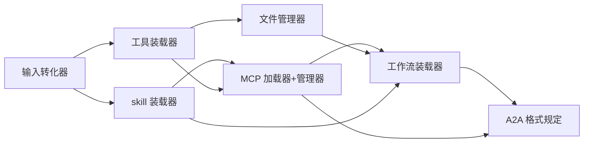

# 03 · 装载器与 A2A 规范

> 层级归属：平台底座 · ③ agent 层
> 原始素材：`插件逻辑/工具调用.md` + [图/01](图/01-平台后端底层架构.png) 的 agent 层

agent 层的 7 个部件全部是**装载器**或**规定**，不含业务逻辑。每个装载器遵循同一套契约：清单驱动、依赖装载、健康检查、崩溃隔离。

## 0. 装载器通用契约

```ts
interface Loader<TManifest> {
  readonly kind: LoaderKind;
  /** 按清单装载。返回句柄，失败不抛出到调用方 */
  load(manifest: TManifest, ctx: LoadContext): Promise<LoadResult>;
  /** 健康检查：装载器自检 + 被装载对象自检 */
  healthCheck(handleId: string): Promise<HealthReport>;
  /** 卸载。必须能独立卸载，不影响其他已装载对象 */
  unload(handleId: string): Promise<void>;
}

type LoaderKind =
  | "skill" | "tool" | "mcp" | "workflow"
  | "file" | "input" | "a2a";

interface LoadResult {
  ok: boolean;
  handleId?: string;
  degraded?: boolean;      // 部分能力可用
  error?: { code: string; message: string; retryable: boolean };
}
```

### 自举重加载

> 插件加载在依赖上加载，使得插件崩溃不会带崩程序。

三条硬规则：

1. **依赖序装载**：A 依赖 B，则 B 先装载。B 装载失败时 A 标记 `degraded`，不整体失败。
2. **异常不外抛**：任何被装载对象抛出的异常，由装载器捕获成 `LoadResult.error`，绝不上抛到底座主循环。
3. **独立卸载**：卸载一个对象不得影响正在使用它的其他对象；引用计数归零才真正释放。

## 1. skill 装载器

装载**技能包**。一个 skill 是可复用的能力说明书 + 可选脚本。

```ts
interface SkillManifest {
  id: string;
  version: string;
  description: string;
  /** 触发条件：被哪个整合包、哪个状态、哪种意图唤醒 */
  triggers: {
    packageIds?: string[];
    states?: string[];
    intentMatch?: string[];
  };
  /** 该 skill 声明自己需要什么能力 */
  requires: { tools?: string[]; mcpServers?: string[]; skills?: string[] };
  /** 提示规则片段，注入到整合包的 promptPolicy */
  promptFragments?: string[];
  artifacts?: ArtifactRef[];
}
```

- **触发是声明式的**：skill 自己声明在什么整合包、什么状态下可用，底座只做匹配。
- **提示规则可组合**：多个 skill 的 `promptFragments` 按整合包规则拼装，而不是互相覆盖。
- **MCP 循环依赖**：skill 声明 `requires.mcpServers`，由 MCP 加载器负责解析，skill 装载器不直接装载 MCP。

## 2. 工具装载器

装载**本地可执行工具**，含办公工具。

```ts
interface ToolManifest {
  id: string;
  version: string;
  /** 执行入口。进程内函数或子进程均可 */
  entry: { kind: "inproc" | "process"; command: string; args?: string[] };
  ioSchema: {
    input: SchemaRef;
    output: SchemaRef;
  };
  /** 权限声明。运行时按整合包授权求交集 */
  permissions: Array<"fs:read" | "fs:write" | "net" | "process" | "device" | "clipboard">;
  /** 健康检查 */
  healthCheck?: { command: string; timeoutMs: number };
  /** 办公工具标记 */
  office?: { app: "word" | "excel" | "ppt" | "outlook"; mode: "com" | "cli" };
}
```

- **办公工具**作为一类特殊工具装载。Windows 用 COM 自动化，非 Windows 用 CLI 兜底，两者实现不同但暴露同一 `ioSchema`。
- **权限求交**：工具声明 `permissions`，整合包声明授权范围，实际可调用权限是**交集**，工具多声明无效。

## 3. MCP 加载器 + 管理器

装载 MCP Server，并管理调用质量与线程。

```ts
interface McpServerManifest {
  id: string;
  transport: "stdio" | "sse" | "http";
  command?: string;
  args?: string[];
  url?: string;
  env?: Record<string, string>;
  /** 召回率目标。低于目标触发重排或降权 */
  retrieval: { targetRecall: number; topK: number; rerank?: string };
  /** 线程管理 */
  threading: { maxConcurrent: number; perSession?: boolean; idleTimeoutMs: number };
}

interface McpManager {
  /** 调用与召回率观测 */
  observe(serverId: string, query: string, recalled: string[]): McpObservation;
  /** 按实测召回率调整排序权重 */
  reweight(serverId: string): void;
  /** 线程管理：按 server / session 分配与回收 */
  /** MCP server 线程。sessionId 指线程归属的会话（用户对话线程），不是 CLI 会话 */
  acquire(serverId: string, sessionId: string): Promise<McpThread>;
  release(thread: McpThread): void;
}
```

- **MCP 调用与召回率**：每次调用记录"问了什么 / 召回了什么"，持续统计真实召回率，低于 `targetRecall` 的 server 自动降权或触发重排。
- **MCP server 线程管理**：每个 server 独立线程池，`perSession` 决定线程是否跨对话会话复用。空闲超时回收，避免端口和内存泄漏。

## 4. 工作流装载器

装载工作流，处理自动触发识别和 hook 验证。

```ts
interface WorkflowManifest {
  id: string;
  version: string;
  /** 识别自动触发的规则 */
  autoTrigger: {
    intents: string[];
    conditions?: ConditionExpr[];
    cooldownMs?: number;
  };
  states: string[];
  transitions: Array<{
    from: string; on: string; to: string;
  }>;
  /** hook 验证：每个关键节点前后都挂验证钩子 */
  hooks: Array<{
    at: { state: string; phase: "before" | "after" };
    validator: string;          // 被验证器名称，需已装载
    selfImprove?: boolean;      // 失败后自完善补充
  }>;
  /** 失败处理 */
  onFailure: "abort" | "retry" | "degrade" | "handoff";
}
```

- **识别自动触发加载器**：意图 + 条件命中即自动装载并启动工作流，无需用户显式选择。
- **hook 验证和自完善补充**：验证器失败时，若开启 `selfImprove`，工作流自己补充缺失的步骤/知识后重试，而不是直接失败。
- **失败不外抛**：`onFailure: "handoff"` 允许把不完整的任务交给另一个整合包继续。

## 5. 文件管理器

文件读写、包管理，以及底层调用转化器。

```ts
interface FileManager {
  read(path: string, encoding?: string): Promise<FileContent>;
  write(path: string, content: string, opts?: WriteOptions): Promise<WriteResult>;
  /** 包管理：把一组文件作为可分发的包处理 */
  pack(members: string[], opts?: PackOptions): Promise<PackageRef>;
  unpack(ref: PackageRef, dest: string): Promise<void>;
  /** 底层调用转化器：把"无版本控制"的环境转化为"有版本控制" */
  toVCS(strategy: VcsStrategy): Promise<VcsBinding>;
}

type VcsStrategy = "none-to-git" | "existing-git" | "worktree";
```

- **包管理和底层调用转化器（无 → git）**：目标环境没有版本控制时，文件管理器自动初始化 git 仓库，让"检查点""回滚""分支"这些能力始终可用。发布、回滚、审计都依赖这一条。

## 6. 输入转化器

各类输入 → agent 统一输入格式。

```ts
interface InputTransformer {
  id: string;
  from: "text" | "voice" | "image" | "file" | "clipboard" | "screenshot" | "keypad";
  to: StructuredInput;
  transform(raw: unknown, ctx: TransformContext): Promise<StructuredInput>;
}

interface StructuredInput {
  kind: string;
  text?: string;
  /** 特殊词汇清洗结果 */
  normalized?: string;
  attachments: ArtifactRef[];
  /** 截图类输入保留位置信息 */
  viewport?: { screen: { w: number; h: number }; region?: { x: number; y: number; w: number; h: number } };
  confidence?: number;
}
```

- **截图位置信息**必须保留：全屏尺寸 + 截图区域，供 IDE/可视化界面回溯定位。
- **特殊词汇清洗**在这里做，清洗规则由整合包 `promptPolicy` 提供（见 [11 §4](11-设计理念与硬性约束.md)）。
- **置信度**透传，低置信度输入（如语音识别）应触发澄清而不是直接执行。

## 7. A2A 格式规定

Agent-to-Agent 交换格式的统一规定。

```ts
interface A2AEnvelope {
  protocolVersion: string;
  messageId: string;
  threadId: string;              // 关联到 McpThread
  from: AgentRef;                // { kind: "agent" | "package"; id: string }
  to: AgentRef;
  intent: string;
  payload: unknown;
  /** 交接与整合包衔接复用同一格式 */
  handoff?: HandoffEnvelope;
  signature?: string;
}

interface AgentRef {
  kind: "agent" | "package" | "plugin" | "suite";
  id: string;
  version: string;
}
```

- **统一信封**：所有 agent 间交换（含交接）共用一个信封，避免每种协作场景自定义格式。
- **跨对象统一引用**：`AgentRef.kind` 覆盖 agent / 整合包 / 插件 / 套件，因此插件之间也能用同一协议通信。

## 8. 装载顺序与依赖图



装载按依赖序进行：输入和工具最底层，MCP 依赖工具，工作流依赖全部，workflow 装载器是整合包启动的入口。
