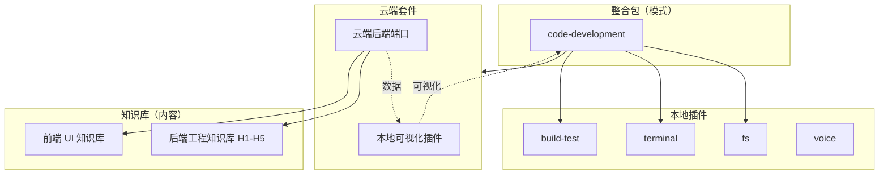

# 04 · 三大核心对象：套件 / 插件 / 整合包

> 本文件是术语的**权威定义**。其他文档引用这三个词时以本文为准。

系统里只有三种对象在流转。用户直接操作的是**整合包**；能力来自**插件**和**套件**。

## 1. 一张表看清区别

| | 套件 Suite | 插件 Plugin | 整合包 Package |
|---|---|---|---|
| **在哪** | 云端 | 本地 | 本地（编排） |
| **是什么** | 云端辅助能力的集合 | 本地小功能单元 | 面向用户的工作模式 |
| **用户看得见吗** | 否（间接触感） | 否 | **是** |
| **决定工作流程吗** | 否 | 否 | **是** |
| **能独立复用吗** | 能 | 能 | 不能（依赖被它选中的插件/套件） |
| **可替换吗** | 是（换供应商） | 是（换实现） | 否（是模式本身） |
| **举例** | 云端模型、知识库检索、远程代码分析、远程构建、团队协作、远程执行 | 文件读写、项目扫描、代码格式化、本地终端、本地模型、语音输入输出、本地测试构建、截图剪贴板 | 语音助手、代码开发、项目监测、设计转代码 |

## 2. 套件 Suite

> 套件是**云端辅助能力的集合**。

### 2.1 组成

一个套件由两个部分构成，缺一不可：

- **本地插件**：负责可视化，嵌入 agent 中
- **云端后端端口**：负责提供数据

详见 [05-云端套件双体结构](05-云端套件双体结构.md)。

### 2.2 契约

```ts
interface SuiteManifest {
  id: string;
  version: string;
  /** 能力声明：整合包只依赖这个，不依赖具体供应商 */
  capabilities: SuiteCapability[];
  /** 本地可视化插件 */
  localPlugin: PluginRef;
  /** 云端后端端口 */
  endpoints: SuiteEndpoint[];
  auth: { scheme: "bearer" | "mtls" | "local" | "none"; ref: string };
  degradation: SuiteDegradation;   // 云端不可用时如何降级
}

interface SuiteCapability {
  name: string;                     // "code.generate" | "kb.search" | "build.remote"
  version: string;
  cost?: { unit: string; hint: string };
  sla?: { p95Ms: number; availability: number };
  inputSchema: SchemaRef;
  outputSchema: SchemaRef;
}
```

### 2.3 原则

- **只暴露能力，不暴露供应商**。整合包声明"我要 `kb.search`"，不声明"我要某某产品的检索接口"。
- **降级必须声明**。云端挂掉时套件要能降级（通常降到本地插件能力），而不是让整合包失败。
- **内容分级**。后端知识库套件内部按 H1–H5 等级组织内容，见 [08](08-后端工程知识库.md)。

## 3. 插件 Plugin

> 插件是**本地的小功能单元**，提供一种可复用能力。

### 3.1 典型插件

| 插件 | 能力 | 权限 |
|---|---|---|
| `fs` | 文件读写 | `fs:read` `fs:write` |
| `project-scan` | 项目扫描、语言检测、约束探测 | `fs:read` |
| `format` | 代码格式化 | `fs:read` `fs:write` `process` |
| `terminal` | 本地终端调用 | `process` |
| `local-model` | 本地模型调用 | — |
| `voice` | 语音输入输出 | `device` |
| `build-test` | 本地测试与构建 | `fs:write` `process` |
| `device-input` | 截图、剪贴板、设备输入 | `device` `clipboard` |
| `git` | 版本控制（由文件管理器的"无→git"产生） | `fs:read` `fs:write` `process` |
| 套件可视化插件 | 每个套件配一个，把云端能力嵌入 agent 界面 | `net` |

### 3.2 契约

```ts
interface PluginManifest {
  id: string;
  version: string;
  description: string;
  capabilities: PluginCapability[];
  permissions: Permission[];
  /** 依赖的其他插件，按依赖序装载 */
  requires?: string[];
  healthCheck?: HealthCheckSpec;
  /** 归属：独立插件 or 某套件的可视化插件 */
  ownedBySuite?: string;
}
```

### 3.3 原则

- **提供能力，不决定流程**。插件不知道整合包的存在，只暴露能力。
- **可被多个整合包复用**。同一个 `fs` 插件被代码开发和设计转代码同时用。
- **清单驱动**。权限、健康检查、依赖全在清单里声明，运行时只读清单。
- **崩溃不带崩程序**。由装载器保证，见 [03 §0](03-装载器与a2a规范.md)。

## 4. 整合包 Package

> 整合包是面向用户的**工作模式和完整工作流配置**。用户切换的是整合包，运行时实际调度的是整合包声明的插件和套件。

### 4.1 内置整合包

| 整合包 | 用途 | 默认语言/栈 | 典型交接目标 |
|---|---|---|---|
| `voice-assistant` | 语音助手：收集需求、澄清、记录决策 | — | `code-development` |
| `code-development` | 代码开发：计划、修改、测试、汇报 | TypeScript / React | `project-monitor` |
| `project-monitor` | 项目监测：状态跟踪、异常发现、汇报 | TypeScript | `code-development` |
| `design-to-code` | 设计转代码：从设计稿到可用页面 | TypeScript / React | `code-development` |

### 4.2 契约

```ts
interface IntegrationPackageManifest {
  id: string;
  name: string;
  version: string;

  /** 执行环境：语言、框架、平台、提示规则、汇报格式、模型策略 */
  profile: {
    language?: string;
    framework?: string;
    platform?: string;
    promptPolicy: string;
    reportFormat: string;
    /** 想要什么模型，不指定账号。见 整合包/开发文档.md §2.3 */
    modelPolicy?: {
      byTaskKind?: Record<string, string[]>;
      transport?: "api" | "cli" | "auto";
    };
  };

  plugins: string[];
  suites: string[];

  states: string[];
  transitions: PackageTransition[];
}

interface PackageTransition {
  targetPackageId: string;
  trigger: "manual" | "完成条件" | "建议交接";
  /** 交接所需事实。缺失则不允许交接 */
  requiredFacts: string[];
  /** 交接字段映射：源包字段 → 目标包字段 */
  handoffMapping: Record<string, string>;
  /** 目标包自动准备什么 */
  prepare?: PrepareSpec[];
}

interface PrepareSpec {
  kind: "language" | "framework" | "promptRules" | "tools" | "reportFormat" | "taskSplit" | "validation";
  value: unknown;
}
```

### 4.3 状态机

```text
讨论 → 计划 → 工作 → 微调修正 → 汇报
```

- 状态可**回退**（工作态发现问题回到计划态）。
- 状态可**并行**（多个独立任务同时处于工作态）。
- 汇报态做**汇总排序**（见 [10 §4](10-工作台与项目管理.md) 的过程性展示）。
- 每个状态可以绑定验证 hook，验证失败按工作流装载器的规则自完善或降级。

### 4.4 原则

- **组合而非实现**。整合包只声明"用哪些插件、哪些套件、按什么规则编排"。
- **默认值可被覆盖**。项目级约束、当前任务、用户最新指令可覆盖 `profile`，覆盖项必须写入交接事件，保持可追踪。
- **交接是标配不是特例**。每个整合包都要声明 `transitions`。

## 5. 三者的关系图



注意最后两条：**知识库只被云端套件读取，它不进入运行时，也不被插件直接访问。** 前端/后端知识库是内容，不是系统。

因此**本地插件也碰不到 07/08**，`i18n` 也不例外 —— 它对知识库内容只能**在装载期给内容附加译文**，不接管知识库的组织与分级，运行时读知识库仍走云端套件。

## 6. 会话不是第四个核心对象

> 这一节存在是为了防止有人把「会话」提上来当第四类。写死它。

系统里有**会话**（`SessionRef`，用户的对话线程），但它**不是核心对象**，和套件/插件/整合包不在同一个分类轴上：

| | 三大核心对象 | 会话 |
|---|---|---|
| **是什么** | 能力的**性质** | 编排对象的**实例** |
| **分类依据** | 这东西是本地还是云端、是能力还是模式 | 这东西在第几次运行、有多长的生命周期 |
| **谁定义它** | 开发者（清单 + 注册表） | 运行时（用户开的） |
| **有多少个** | 有限、随版本变 | 无上限、随用户操作变 |
| **换掉它** | 换插件实现 | 换个会话继续，用户无感 |

**会话是整合包的实例维度。** 整合包是"模式"（一份清单、一个文件夹），会话是"用户开的一次 `code-development`"。同一个整合包被开十次就是十个会话，它们共享同一份清单与同一批插件，但各有各的对话历史、工作区、模型账号、语言。

**整合包挂在会话上，不挂在应用上。** 同一个会话可以切换着挂不同整合包，切换走 06 的交接协议（时空衔接）。所以「换模式」和「换会话」是两个不同的动作：

| | 换整合包（同一个会话内） | 换会话 |
|---|---|---|
| `sessionId` | 不变 | 变 |
| 发生什么 | 交接（传上下文、传已确认决策） | 什么也不传，两边互不相干 |
| 规范 | [06](06-模式衔接与交接协议.md) 交接协议 | [12 §8](12-TypeScript接口契约.md) 契约 |
| 用户感知 | 「这个项目切到另一种做法」 | 「我另开了一个对话」 |

**会话容器在核心里，跨会话派活在插件里。** 核心持有 `SessionRef` 和会话容器（对话循环、消息、工作区绑定），因为每一条消息都要落到某个会话里，埋点也要知道这次执行属于谁。但**把活派到另一个会话、读另一个会话的历史、自然语言拉起新会话**这三件事是 [session-hub](../插件/协作/session-hub/开发文档.md) 插件的事，不进核心。

这个切法是刻意的：它让 `插件/README` 那条判据对它依然成立 —— **单独关掉 `session-hub`，系统照常跑，只是退回单会话**。如果把整个会话做成插件，这条判据对它字面为假（关掉就没有会话了，记忆域的窗口层、整合包状态机、公文式汇报全部失去作用域），主核心单薄就守不住了。
