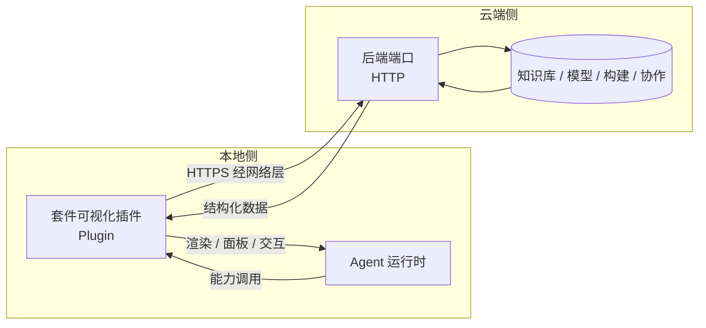
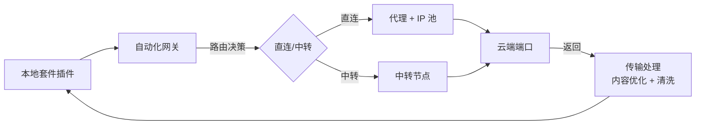

# 05 · 云端套件：双体结构

> 云端辅助能力不是一个点，是**两个部分**。

## 1. 双体定义

| | 本地插件 | 云端后端端口 |
|---|---|---|
| **职责** | **可视化**，嵌入 agent 中 | **提供数据** |
| **运行位置** | 用户本地 | 云端（机构内网或公域） |
| **实现形式** | Plugin | HTTP 端口 + 数据 |
| **用户感知** | 直接可见（界面、面板、交互） | 间接（通过本地插件呈现） |
| **对整合包暴露** | 作为 `plugins[]` 条目 | 作为 `suites[]` 条目的能力 |

一句话：**云端负责"有什么数据"，本地负责"怎么看、怎么操作"。**

## 2. 为什么必须拆成两体

1. **数据在云端，交互在本地**。知识库、模型、远程构建结果都存在云端，但用户是在本地 agent 里操作。数据不能直接渲染成本地 UI，中间必须有一层。
2. **可替换性**。云端端口可换供应商（直连/中转、模型切换），本地可视化插件不动。符合"全部内容只提供接口"。
3. **降级路径清晰**。云端端口不可用时，本地可视化插件切换为离线态，明确告诉用户哪些能力不可用，而不是静默失败。
4. **出网受控**。本地只对已知套件端口发起请求，经过底座网络层的网关/代理/IP 池管理（见 [02 §3](02-平台底座-后端底层架构.md)）。

## 3. 套件完整结构



- **上行**：运行时 → 本地插件 → （经过网络层） → 云端端口 → 数据
- **下行**：云端端口 → 本地插件 → 运行时渲染
- **本地插件是唯一的数据出入口**，运行时永远不直连云端端口。

## 4. 契约

### 4.1 套件清单

```ts
interface SuiteManifest {
  id: string;
  name: string;
  version: string;
  /** 能力声明：整合包只依赖这个 */
  capabilities: SuiteCapability[];
  /** 本地可视化插件：嵌入 agent 的部分 */
  localPlugin: PluginRef;
  /** 云端后端端口：提供数据的部分 */
  endpoints: SuiteEndpoint[];
  auth: AuthSpec;
  /** 云端不可用时的降级策略 */
  degradation: DegradationSpec;
}

interface SuiteEndpoint {
  id: string;
  baseUrl: string;                    // 可指向内网端口
  /** 走直连还是中转，由网络层网关决定 */
  route: "direct" | "relay" | "auto";
  protocol: "https" | "http-internal";
  healthPath: string;
  timeoutMs: number;
}
```

> **这里的 `relay` 和账号的 `kind: "relay"` 不是一回事。**
>
> | | 是什么 | 谁管 |
> |---|---|---|
> | `SuiteEndpoint.route: "relay"` | **平台自己的转发节点**（图里的 `RL`） | 网络层网关 |
> | `ModelAccount.kind: "relay"` | **第三方中转站** | [10 §2.3](10-工作台与项目管理.md) + [relay-hub](../插件/适配/relay-hub/开发文档.md) |
>
> 前者是**基础设施**，随套件走；后者是**账号属性**，决定怎么让外部 CLI 读到配置。两者没有继承、没有交叉引用。
>
> **但中间层重写 payload 的风险对两者一视同仁** —— 所以约束是同一条：见 [02 §3.2](02-平台底座-后端底层架构.md) 的网关透射性契约。

interface DegradationSpec {
  /** 云端挂掉时，整合包继续能做什么 */
  offline: {
    available: string[];              // 仍可用的能力名
    unavailable: string[];            // 明确不可用的能力名
    localFallback?: string;           // 降级到的本地插件 id
    userNotice: string;               // 呈现给用户的话术
  };
}
```

### 4.2 本地可视化插件清单

```ts
interface SuiteVisualPluginManifest extends PluginManifest {
  /** 归属套件。运行时用它把插件和套件绑起来 */
  ownedBySuite: string;

  /** 可视化配置：本地插件向 agent 声明它能呈现什么 */
  view: {
    /** 呈现形态 */
    surface: "panel" | "inline" | "modal" | "tab" | "overlay" | "none";
    /** 该套件的哪些能力在界面上暴露为可操作项 */
    exposes: string[];
    /** 只读展示还是可写操作 */
    mode: "read" | "read-write";
    /** 离线态呈现 */
    offlineView?: string;
  };

  /** 本地插件调云端端口的客户端配置 */
  client: {
    endpointId: string;
    retry: { max: number; backoffMs: number };
    cache: { enabled: boolean; ttlMs: number };
  };
}
```

### 4.3 运行时如何装配一个套件

```ts
// 伪代码：装载器按依赖序装配
async function mountSuite(suite: SuiteManifest, ctx: MountContext) {
  // ① 先装载本地可视化插件（它自己不发请求，只等数据）
  const local = await pluginLoader.load(suite.localPlugin, ctx);

  // ② 装配套件能力到运行时
  const caps = suite.capabilities.map(c => registry.registerCapability(c, {
    via: suite.localPlugin.id,      // 能力经由本地插件
    endpoint: suite.endpoints[0].id,
  }));

  // ③ 注册降级
  ctx.registerDegradation(suite.id, suite.degradation);

  return { local, caps };
}
```

## 5. 内置套件清单

系统需要以下套件。每个套件都是双体结构。

| 套件 | 云端端口提供 | 本地插件提供 |
|---|---|---|
| `model-suite` | 模型推理、供应商路由、缓存 | 模型选择面板、流式输出渲染 |
| `kb-frontend-suite` | 前端 UI 知识库：组件、Token、SVG/PNG 素材、版本 | 组件检索面板、组件预览、拖拽装配 |
| `kb-backend-suite` | 后端工程知识库：服务模板、API、数据模型、**H1–H5 分级** | 模板检索面板、语言切换、等级筛选 |
| `remote-analysis-suite` | 远程代码分析、依赖图、影响面分析 | 分析结果可视化（依赖图/影响面） |
| `remote-build-suite` | 远程构建、测试执行、产物归档 | 构建状态面板、日志流 |
| `collaboration-suite` | 团队协同、共享上下文、冲突合并 | 协同状态面板、成员视图 |
| `remote-exec-suite` | 远程执行、指令下发、执行端交互 | 执行控制台 |

## 6. 网络层与套件的衔接

套件的出网请求全部经过底座网络层：



对应 [02 §3](02-平台底座-后端底层架构.md) 的网络层五个子模块。**本地插件不直接建立网络连接**，一律经网关，这样才受 IP 池锁定、缓存、供应商切换的统一管控。

## 7. 离线与降级

云端套件不可用时的三级降级：

| 级别 | 条件 | 行为 |
|---|---|---|
| **完全可用** | 端口健康检查通过 | 正常调用 |
| **缓存可用** | 端口失败但本地缓存命中 | 返回缓存数据，标注"来自缓存" |
| **离线** | 端口失败且无缓存 | 按 `degradation.offline` 声明：可用能力照常，不可用能力在界面上明确置灰并给出 `userNotice` |

**绝不静默失败。** 不可用就是不可用，用户必须知道。

## 8. 知识库在双体中的位置

明确一遍，避免混淆：

- **知识库 = 内容**，由云端端口保存和提供。
- **知识库 ≠ Agent 系统**。前端 UI 知识库和后端工程知识库都不是本系统的组成部分，它们是 `kb-frontend-suite` 和 `kb-backend-suite` 背后的数据。
- 知识库是**逐步填充**的：初始可以是空骨架 + 接口，内容后续录入，带版本和来源信息。

详见 [07](07-前端UI知识库.md) 和 [08](08-后端工程知识库.md)。
