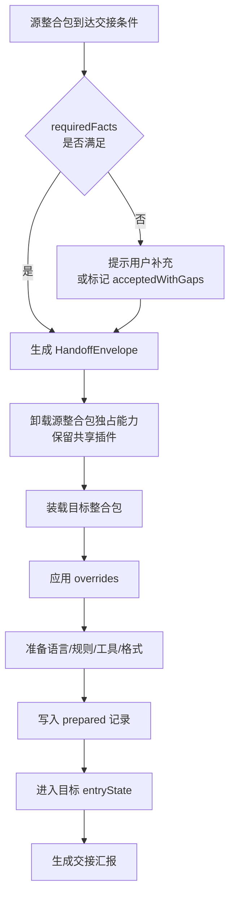
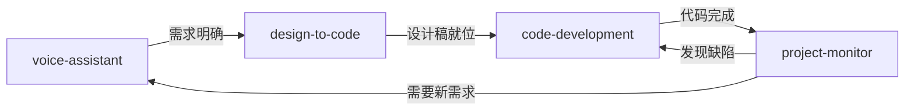

# 06 · 模式衔接与交接协议

> 整合包之间可以互相衔接。切换**不是重新开始**，而是把当前任务封装成一个交接包，由目标整合包重新准备执行环境。

## 1. 核心模型：时空衔接

模式切换时要传递两类信息。

### 1.1 时间连续性（"从哪来"）

工作过程的连续性：

- 对话和语音记录
- 已确认的需求和决策
- 任务状态、阶段和检查点
- 之前的输出、错误和人工修改
- 需要继续处理的待办事项

### 1.2 空间连续性（"在哪干"）

工作环境的连续性：

- 项目、工作区和文件夹
- Git 分支或版本检查点
- 目标平台、框架和运行环境
- 已加载的插件、套件和权限
- 文件引用、服务地址和凭据引用

### 1.3 目标整合包的自动准备（"怎么干"）

目标整合包接收交接包后，**自动准备**六件事：

| 准备项 | 来源 | 示例 |
|---|---|---|
| 开发语言和框架 | `profile.language` `profile.framework` | 语音助手 → 代码开发：自动切到 TypeScript + React |
| 提示词和行为规则 | `profile.promptPolicy` | 代码开发：代码风格、审查规则、禁止事项 |
| 可调用的插件、套件和工具 | `plugins[]` `suites[]` | 代码开发：加载 `fs` `terminal` `build-test` + `model-suite` |
| 任务拆分方式 | `prepare.taskSplit` | 代码开发：按文件 → 按函数 → 按测试 |
| 结果验证方式 | `prepare.validation` | 代码开发：类型检查 → 单元测试 → 构建 |
| 汇报和输出格式 | `profile.reportFormat` | 代码开发：变更文件、测试结果、待决策项 |

**这是模式衔接的核心价值**：用户切了模式，工具、语言、规则、汇报格式全部自动就位，不需要重新交代一遍。

## 2. 交接包数据模型

交接数据采用**版本化的 TypeScript 契约**。大文件、代码、截图、音频放在项目制品存储中，交接包只保存**引用和结构化事实**。

```ts
interface HandoffEnvelope {
  schemaVersion: string;
  handoffId: string;
  createdAt: string;

  source: {
    packageId: string;
    sessionId: string;
    state: string;              // 交接时源整合包所处的状态
  };
  target: {
    packageId: string;
    entryState?: string;        // 目标整合包的进入状态，默认由 transitions 决定
  };

  // ── 空间连续性 ──
  project: {
    projectId: string;
    workspacePath?: string;
    branch?: string;
    checkpoint?: string;
  };

  // ── 时间连续性 ──
  task: {
    objective: string;
    constraints: string[];
    decisions: string[];
    openQuestions: string[];
    nextActions: string[];
  };

  history: {
    conversationRef?: string;
    eventRef?: string;
    artifactRefs: string[];
  };

  // ── 执行环境 ──
  runtime: {
    /** 开发语言。指编程语言，不是人读文本的语言 —— 那个叫 locale */
    language?: string;
    framework?: string;
    platform?: string;
    pluginIds: string[];
    suiteIds: string[];
    /** 会话级语言与账号。交接不改变它们，所以必须一起传，
     *  否则在同一个会话里切整合包会把这会话的语言和账号掉回全局 */
    locale?: LocaleRef;
    accountId?: string;
  };

  output: {
    requestedFormat?: string;
    reportFormat?: string;
  };

  /** 覆盖记录：项目约束/当前任务/用户最新指令对默认值的覆盖，必须可追踪 */
  overrides: HandoffOverride[];

  /** 准备记录：目标整合包实际准备了什么 */
  prepared: PreparedSpec[];

  /** 完整性：requiredFacts 校验结果 */
  completeness: {
    required: string[];
    satisfied: string[];
    missing: string[];
    acceptedWithGaps: boolean;   // 缺事实时是否仍然交接
  };
}

interface HandoffOverride {
  field: string;                // "runtime.language"
  from: unknown;                // 源整合包的默认值
  to: unknown;                  // 覆盖后的值
  reason: "project" | "task" | "user" | "detected";
  by: string;                   // 覆盖来源标识
  at: string;                   // 时间戳
}

interface PreparedSpec {
  kind: "language" | "framework" | "promptRules" | "tools" | "reportFormat" | "taskSplit" | "validation";
  value: unknown;
  appliedBy: string;            // 目标整合包 id
}
```

## 3. 交接流程



五个关键动作：

1. **校验**（`completeness`）：检查 `requiredFacts` 是否齐全。缺事实时提示补充，或由用户确认带缺口交接。
2. **封装**（`HandoffEnvelope`）：只装引用和结构化事实，不装大文件。
3. **卸载**（E）：卸载源整合包独占的插件/套件，**保留共享插件**（如 `fs` 被两个模式共用）。这就是"可被多个整合包复用"的兑现。
4. **准备**（G/H）：应用覆盖项，然后按 `prepare` 声明自动准备六件事。
5. **记账**（I/K）：`prepared` 和 `overrides` 都写进交接事件，全程可追踪。

## 4. 交接类型

```ts
type HandoffTrigger = "manual" | "完成条件" | "建议交接";
```

| 类型 | 含义 | 是否阻塞 |
|---|---|---|
| **manual** | 用户主动切换 | 不阻塞，随时可切 |
| **完成条件** | 目标整合包声明的 `requiredFacts` 全部满足 | 满足前不允许切 |
| **建议交接** | 运行时判断当前模式不再适合，建议切换 | 不阻塞，只是提示 |

## 5. 示例：语音助手 → 代码开发

### 5.1 触发

`voice-assistant` 的 `transitions` 声明：

```ts
{
  targetPackageId: "code-development",
  trigger: "完成条件",
  requiredFacts: ["objective", "projectId", "decisions"],
  handoffMapping: {
    "task.objective":   "task.objective",
    "task.decisions":   "task.decisions",
    "history.conversationRef": "history.conversationRef",
    "history.artifactRefs":    "history.artifactRefs",
  },
  prepare: [
    { kind: "language",     value: "typescript" },
    { kind: "framework",    value: "react" },
    { kind: "promptRules",  value: "code-development/default" },
    { kind: "reportFormat", value: "code-development/change-report" },
  ],
}
```

### 5.2 交接包内容

```text
source:  voice-assistant / session=s-1 / state=汇报
target:  code-development / entryState=计划
project: proj-1 / workspace=/w/demo / branch=main
objective:    将语音记录整理出的需求实现为项目功能
constraints:  [TS 严格模式, 不引入新依赖]
decisions:    [用 React 而非 Vue, 用本地存储而非后端]
inherited:    需求记录, 决策, 截图引用, 文件引用, 待办事项
prepared:     TypeScript + React, 代码开发提示规则,
              代码审查规则, 测试规则, 代码变更汇报格式
```

### 5.3 目标包收到后

1. 检查工作区和项目约束（扫 `package.json`、tsconfig、已有依赖）；
2. 检测结果**覆盖**默认 framework（项目是 Vue 就用 Vue，`overrides` 记录 `reason: "detected"`）；
3. 进入**计划态**，按 `taskSplit` 拆分任务；
4. 按 `validation` 准备验证链（类型检查 → 单元测试 → 构建）；
5. 按 `reportFormat` 输出公文式汇报。

## 6. 链式交接与回路

交接不是单跳，可以链式，也可以回环：



- **链式**：`handoffMapping` 逐跳传递，`history` 段累积，每一跳都追加而非覆盖。
- **回路**：状态可以回退，整合包也可以回切。回切时上一跳的交接包仍在 `history` 里，可以恢复。
- **回切保留现场**：回切时执行 E 步会保留共享插件，因此回切后不需要重新加载环境。

## 7. 交接事件的持久化

每次交接写一条不可变事件：

```ts
interface HandoffEvent {
  eventId: string;
  at: string;
  envelope: HandoffEnvelope;
  outcome: "success" | "degraded" | "failed";
  /** 交接后用户是否回切 */
  rolledBackTo?: string;
}
```

交接事件是审计和追溯的依据。权限变更、审计、回滚全部依赖它。

## 8. 交接 ≠ 跨会话派活

> 这两件事都用「让别的去干」的句式，但走的完全不是一条路。混起来会把两个系统接错。

| | 交接（本文档） | 跨会话派活（[session-hub](../插件/协作/session-hub/开发文档.md)） |
|---|---|---|
| **发生在** | 同一个会话**内** | 两个会话**之间** |
| **发生什么** | 换整合包（换模式） | 换执行者（换会话） |
| **传什么** | 时空：上下文、已确认决策、工作区、分支、凭据引用 | **只有任务**：一句话目标 + 产出引用 |
| **数据模型** | `HandoffEnvelope` | `DispatchProposal` / `DispatchTicket` |
| **谁在收** | 目标整合包（同一个 `sessionId`） | 另一个会话（另一个 `sessionId`） |
| **同步吗** | 同步 —— 交接完成后当前对话就换了个模式 | 异步 —— 派完 A 继续干，B 干完回传 |
| **结束条件** | 交接事件落库 | 派活单 `status` 变 `done` / `failed` |
| **用户在场吗** | 在场，正在同一段对话里 | 可能不在 —— A 说完就去干别的了 |

**为什么必须分开**：交接的价值全在**时空连续**上 —— 换个模式但把上下文、已确认的决策、跑了一半的分支都接上，这才是「切换不是重新开始」（见 [§1](06-模式衔接与交接协议.md)）。跨会话派活**恰恰不传这些**：B 是一个独立的对话线程，它不接 A 的上下文，不接 A 的决策，A 也不把自己的工作区交给 B。

如果跨会话派活也走 `HandoffEnvelope`，会出两个错：一是把 A 的上下文整包塞给 B，B 的上下文被污染；二是 B 干完回传时带着一堆 A 的中间状态，A 的对话被撑爆。**回传只带结论 + 产出引用**，这是刻意的（见 [12 §8.2](12-TypeScript接口契约.md)）。

**唯一共用的是 `HandoffEnvelope.source.sessionId` 和 `Trace.sessionId` 的那个含义** —— 都指用户的对话线程。整合包挂在这个会话上，派活的双方也各是一个会话。
