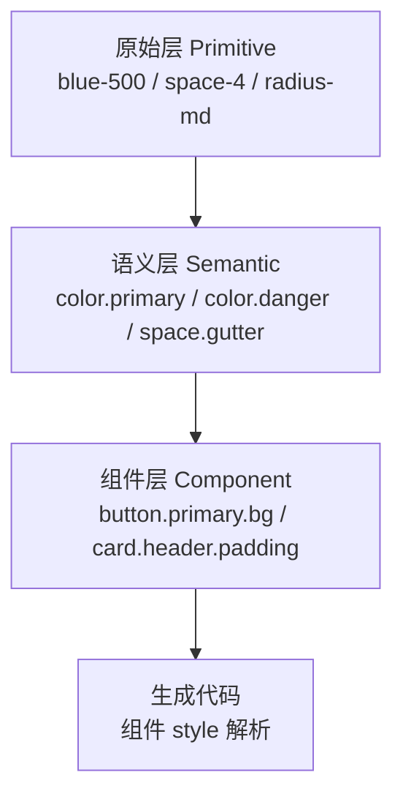
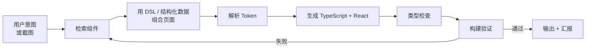

# 07 · 前端 UI 知识库

> ⚠️ **这是知识库，不是本 Agent 系统的组成部分。**
> 它是 `kb-frontend-suite` 云端套件背后的**内容**，由云端后端端口保存，本地可视化插件负责检索和展示。
> 主线是**设计即代码**：Agent 检索组件 → 用 DSL / 结构化数据组合页面 → 生成 TypeScript 前端代码。

## 1. 定位边界

| | 属于本系统 | 不属于本系统 |
|---|---|---|
| 前端知识库 | 检索、装配、生成、验证的**流程** | 组件本身、Token 本身、素材本身 |
| 组件定义 | 检索结果的结构化描述 | 组件的实际实现代码（那是内容，由知识库提供） |
| 设计 Token | 引用和映射机制 | Token 的具体数值 |
| SVG / PNG 素材 | 素材管理和引用 | 素材文件本身 |

**知识内容由用户逐步填充**，系统负责存取、检索、装配、生成。

## 2. 知识内容清单

| 类别 | 必含字段 | 说明 |
|---|---|---|
| **组件定义** | 名称、分类、版本、用法、依赖、适用平台 | 组件的元信息 |
| **组件组合** | 父组件、子组件、槽位、约束 | 组件树 |
| **组件属性** | 属性名、类型、默认值、取值域、必填性 | 代码生成的直接依据 |
| **颜色 / 填充 / 边线** | 视觉参数、Token 引用、单位、平台差异 | 见 §3 |
| **设计 Token** | 名称、层级（原始/语义/组件级）、值、类型 | 见 §4 |
| **SVG / PNG 素材** | 资源 ID、路径、尺寸、格式、许可 | 素材管理 |
| **目标平台** | Web / 桌面端 / 移动端的差异约束 | 同一组件的多平台实现 |
| **实现代码** | 源码、编译产物、依赖清单 | 代码生成的模板来源 |
| **Mock 数据** | 数据结构、样例值、生成规则 | 联调用 |
| **交互流程** | 状态、事件、动效、边界情况 | 交互生成的依据 |
| **说明与检索** | 使用说明、搜索标签、版本、来源、更新时间 | 检索质量的关键 |

## 3. 组件数据模型

```ts
interface UiComponent {
  id: string;                    // 稳定标识
  name: string;
  category: "layout" | "form" | "display" | "feedback" | "navigation" | "overlay" | "data";
  version: string;

  /** 属性：代码生成的直接依据 */
  props: UiProp[];
  /** 视觉参数 */
  style: {
    color?: TokenRef;
    fill?: TokenRef;
    border?: { width?: TokenRef; color?: TokenRef; style?: "solid" | "dashed" | "dotted" | "none"; radius?: TokenRef };
    spacing?: TokenRef;
    typography?: TokenRef;
  };

  /** 组合关系 */
  composition?: {
    children?: string[];         // 组件 id
    slots?: Array<{ name: string; accepts: string[]; required: boolean }>;
  };

  /** 目标平台 */
  platforms: Array<{
    platform: "web" | "desktop" | "mobile";
    framework: "react";          // 首期固定 React
    implementation: ArtifactRef; // 该平台的实现代码
    props?: Partial<UiProp>;      // 平台特有属性
  }>;

  /** 交互流程 */
  interactions: Array<{
    trigger: string;             // onClick / onChange ...
    state: string;               // 前置状态
    action: string;              // 动作
    nextState: string;
  }>;

  mock?: SchemaRef;
  assets?: ArtifactRef[];        // SVG / PNG 素材
  tags: string[];
  source?: { repo?: string; path?: string; license?: string };
  updatedAt: string;
}

interface UiProp {
  name: string;
  tsType: string;                // 直接写进生成代码
  required: boolean;
  default?: unknown;
  oneOf?: unknown[];
  description?: string;
}

interface TokenRef {
  /** Token 名，如 color.primary.500 */
  token: string;
  /** 兜底字面量，Token 缺失时不至于生成坏代码 */
  fallback?: string;
}
```

## 4. 设计 Token 分层



- **原始层**是刻意的颜色/间距/字号/圆角。
- **语义层**表达用途（primary、danger、gutter），是组件默认引用的层。
- **组件层**是组件自己的具体取值，优先于语义层。
- **解析顺序**：组件层 → 语义层 → 原始层 → `fallback` 字面量。
- **换肤**只需替换语义层，组件层不动的部分自动跟随。

## 5. 设计即代码：生成流程



### 5.1 页面 DSL

页面在生成代码之前，先表示为结构化数据。这一步让"调整"和"重新生成"都变便宜。

```ts
interface PageSpec {
  id: string;
  platform: "web" | "desktop" | "mobile";
  framework: "react";
  root: NodeSpec;
  dataSources: SchemaRef[];      // Mock 数据来源
  tokens: { primitive: TokenTable; semantic: TokenTable };
}

interface NodeSpec {
  component: string;             // 组件 id
  props?: Record<string, unknown>;
  style?: Record<string, TokenRef | string>;
  bindings?: Array<{ prop: string; to: string }>;   // 绑定到 mock 数据
  interactions?: Array<{ trigger: string; action: string }>;
  children?: NodeSpec[];
}
```

### 5.2 生成产物

每个 `PageSpec` 生成一组文件：

```text
src/
  pages/<page-id>/
    Page.tsx           # 组件树，props 显式，类型完整
    page.spec.json     # 页面 DSL，回写用
    tokens.ts          # 本页引用的 Token 解析结果
    mock.ts            # Mock 数据
    <page-id>.css      # 由 Token 生成的样式
```

**回写 `page.spec.json` 是关键**：下次用户说"把主按钮改成次要样式"，运行时改的是 spec 再重新生成，而不是让模型重写代码。

## 6. 检索

```ts
interface ComponentQuery {
  text?: string;                 // 自然语言
  tags?: string[];
  category?: UiComponent["category"];
  platform?: PageSpec["platform"];
  visualHints?: ArtifactRef[];   // 截图
  /** 从截图提取的特征 */
  extracted?: { color?: string; layout?: string; density?: string };
  limit?: number;
}
```

- 文本检索：名称 + 说明 + 标签 + 类别。
- 截图检索：提取颜色/布局/密度特征做候选召回。
- **召回率可观测**：检索结果记录"用了哪个、跳过了哪个"，供知识库质量迭代（见 [03 §3](03-装载器与a2a规范.md) 的召回率机制）。

## 7. 首期范围

- 目标栈固定 **Web + React + TypeScript**。
- 知识库可以**是空的**：先跑通"检索 → 装配 → 生成 → 验证"的链路，内容逐步填充。
- 每个录入的组件都要带 `version`、`source`、`updatedAt`，保证可追溯。
- Token 缺失时用 `fallback` 保证生成代码永远可编译。
