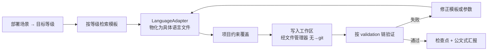

# 08 · 后端工程知识库

> ⚠️ **这是知识库，不是本 Agent 系统的组成部分。**
> 它是 `kb-backend-suite` 云端套件背后的**内容**。主线是**多语言微服务模板**。

## 1. 定位边界

同 [07](07-前端UI知识库.md)：本系统负责检索、装配、生成、验证的**流程**；模板、数据模型、约定这些是**内容**，由知识库提供，用户逐步填充。

后端知识库和前端知识库的关键区别：后端知识库带**等级标注**（H1–H5），因为不同可信场景对模板的完备度、隔离、审计要求完全不同。

## 2. 知识内容清单

| 类别 | 必含字段 | 说明 |
|---|---|---|
| **服务模板** | 服务名、端口、依赖、健康检查、配置项 | 微服务骨架 |
| **API 模板** | 路径、方法、请求/响应 Schema、错误码、鉴权 | 接口契约 |
| **数据模型** | 实体、字段、类型、约束、关系 | 持久层设计 |
| **初始化对象** | 种子数据、默认配置、初始状态 | 环境就绪 |
| **可变/不可变约束** | 字段级可变性、版本策略、冻结规则 | 防止运行期被改坏 |
| **回调 / 拦截器 / 事件** | 钩子点、触发时机、顺序、隔离性 | 横切能力 |
| **Mock 服务** | 假数据、假延迟、故障注入开关 | 联调与测试 |
| **测试数据** | 边界值、异常样本、生成规则 | 测试生成 |
| **语言适配** | Java / Go / Rust / Python 的实现差异 | 多语言 |
| **部署信息** | 镜像、编排、健康探针、资源规格 | 交付 |
| **监控信息** | 指标、日志、追踪、告警规则 | 可观测 |
| **扩展等级** | H1–H5 标注 | 见 §4 |

## 3. 数据模型

```ts
interface ServiceTemplate {
  id: string;
  name: string;
  /** 扩展等级：H1-H5，决定这份模板的完备度和适用场景 */
  level: KnowledgeLevel;
  version: string;

  /** 语言适配：一份模板，多语言实现 */
  language: "java" | "go" | "rust" | "python" | "typescript";

  service: {
    port: number;
    dependencies: string[];
    healthCheck: { path: string; expect: number };
    config: Array<{ key: string; required: boolean; secret: boolean; default?: string }>;
  };

  apis: ApiTemplate[];
  models: DataModel[];
  seeds: SeedObject[];
  hooks: HookSpec[];              // 回调 / 拦截器 / 事件
  mocks: MockSpec[];

  deployment: DeploymentSpec;
  observability: ObservabilitySpec;
  constraints: MutabilitySpec;

  tags: string[];
  source?: { repo?: string; path?: string; license?: string };
  updatedAt: string;
}

interface ApiTemplate {
  method: "GET" | "POST" | "PUT" | "PATCH" | "DELETE";
  path: string;
  auth: "none" | "session" | "token" | "mtls";
  request?: SchemaRef;
  response: SchemaRef;
  errors: Array<{ code: string; httpStatus: number; when: string }>;
  idempotent: boolean;
  timeoutMs?: number;
}

interface MutabilitySpec {
  /** 字段级可变性 */
  fields: Array<{ path: string; mutable: boolean; after?: "create" | "update" | "never" }>;
  /** 版本策略 */
  versioning: "none" | "optimistic" | "append-only" | "sourceless";
  /** 冻结规则：满足条件后禁止修改 */
  freeze?: Array<{ when: string; frozen: string[] }>;
}
```

## 4. ⚠️ H1–H5：知识库等级标注系统

**H1–H5 不是本系统的交付阶段划分，而是云端后端开发知识库内部的等级标注**，用于标注每份模板的**可信场景与完备度**。

检索模板时，目标等级由**部署场景**决定，不是由"我们做到第几期"决定。

| 等级 | 名称 | 目标场景 | 完备度要求 |
|---|---|---|---|
| **H1** | 个人 / 原型 Demo | 单人或小范围验证，**Web + React + TypeScript** | 模板能跑通即可：基本 API、可变数据、基础测试数据。无隔离、无审计要求。 |
| **H2** | 团队 / 正式项目 | 团队内部生产使用 | 完整 API 契约、数据模型约束、回调与拦截器、Mock 服务、测试与构建、基础监控。 |
| **H3** | **机构内小步发布** | 机构内部小范围、分批发布 | + 项目隔离、权限模型、版本与检查点、审计日志、灰度与回滚、发布流程可审计。 |
| **H4** | 公域 / 大并发 | 面向公网、高并发 | + 多实例与水平扩展、限流、熔断、缓存策略、异步任务与队列、链路追踪、容量与压测。 |
| **H5** | **医疗 / 全链路 0 故障** | 医疗等高可靠场景，全链路零故障 | + 数据隔离（租户/患者级）、全链路审计、故障转移、严格发布与回滚、灾备、零故障验证体系。 |

### 4.1 使用方式

```ts
/** 检索时按部署场景定级 */
interface TemplateQuery {
  language?: string;
  serviceType?: string;
  /** 目标等级。取"部署场景要求的等级" */
  level: KnowledgeLevel;
  /** 允许降级取用：H5 场景可以用 H4 模板吗？默认 false */
  allowDowngrade?: boolean;
  tags?: string[];
}

type KnowledgeLevel = "H1" | "H2" | "H3" | "H4" | "H5";
```

- **默认精确匹配**：H3 部署就取 H3 模板。
- **降级取用需显式开启**：`allowDowngrade: true` 且结果被明确标注等级。**向上取用（用 H2 模板部署 H5）永远禁止。**
- **等级是模板的属性**，不是代码的阶段。同一个服务可以有 H1 到 H5 五份模板，内容逐级加厚。

### 4.2 逐级加厚的内容

| 等级 | 该级别**新增**的内容 |
|---|---|
| H1 | 服务骨架、基础 API、初始化对象、可变数据 |
| H2 | 完整 API 契约、不可变约束、回调/拦截器/事件、Mock 服务、测试数据、构建与监控 |
| H3 | 项目隔离、权限模型、版本与检查点、审计日志、灰度发布与回滚 |
| H4 | 水平扩展、限流熔断、缓存策略、异步任务与队列、链路追踪、容量压测 |
| H5 | 患者/租户级数据隔离、全链路审计、故障转移、灾备、严格发布回滚、零故障验证 |

## 5. 多语言适配

一份 `ServiceTemplate` 的 `apis` / `models` / `hooks` 是**语言无关**的；`language` 决定它被翻译成什么。

```ts
interface LanguageAdapter {
  id: string;
  language: ServiceTemplate["language"];
  /** 语言无关模板 → 该语言的具体骨架 */
  materialize(template: ServiceTemplate, ctx: ProjectContext): ArtifactSet;
  /** 项目检测：识别已有项目的语言和框架 */
  detect(workspace: string): Promise<{ language: string; framework?: string; confidence: number }>;
}

interface ArtifactSet {
  files: Array<{ path: string; content: string; language: string }>;
  commands: Array<{ label: string; command: string; description: string }>;
  /** 该语言下的验证链 */
  validation: Array<{ step: string; command: string; expect: "exit0" | RegExp }>;
}
```

| 语言 | 关注点 | 首期 |
|---|---|---|
| **TypeScript** | 平台运行时自身语言；也是后端知识库的首个适配目标 | ✅ 优先 |
| Java | Spring 生态、企业系统接入 | 可插拔 |
| Go | 高并发网关、基础设施 | 可插拔 |
| Rust | 沙箱底层、性能敏感路径 | 可插拔 |

适配器是可插拔的：加一个语言 = 加一个 `LanguageAdapter`，不改运行时。

## 6. 生成与验证



- **物化**：语言无关模板 → 具体语言的骨架、配置、测试、部署文件。
- **项目约束覆盖**：项目已有的包管理、命名、目录结构优先，写入 `overrides` 保持可追踪。
- **无 → git**：环境没有版本控制时，文件管理器自动初始化 git，保证"检查点"和"回滚"始终可用。
- **验证链**：`validation` 由 `LanguageAdapter` 给出，H3 以上追加构建产物校验。

## 7. 首期范围

- 知识库**可以为空**，先跑通"定级 → 检索 → 物化 → 验证 → 检查点"的链路。
- H1 级模板优先录入（跑通链路成本最低），然后逐级补 H2–H5。
- 每份模板必须带 `level`、`version`、`source`、`updatedAt`。
- Java / Go / Rust 适配器可后置；TypeScript 适配器先落地。
