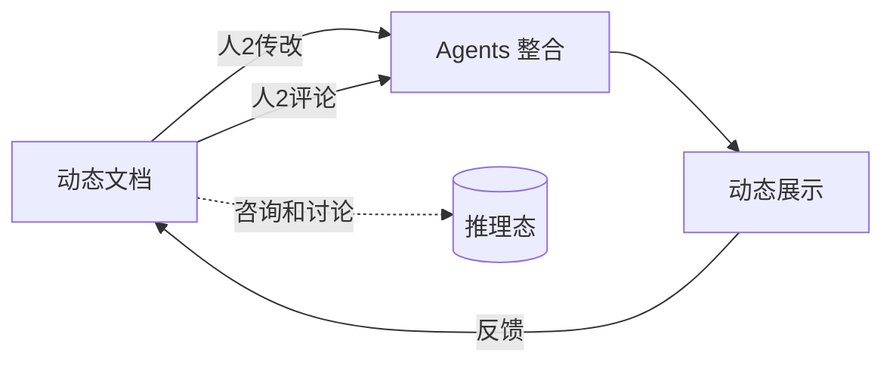
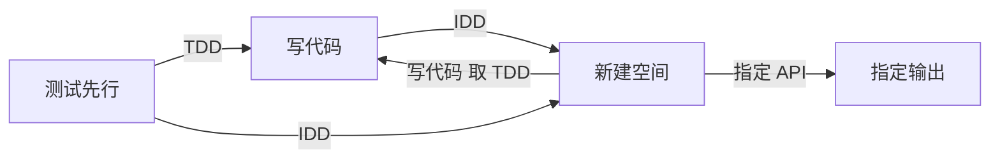
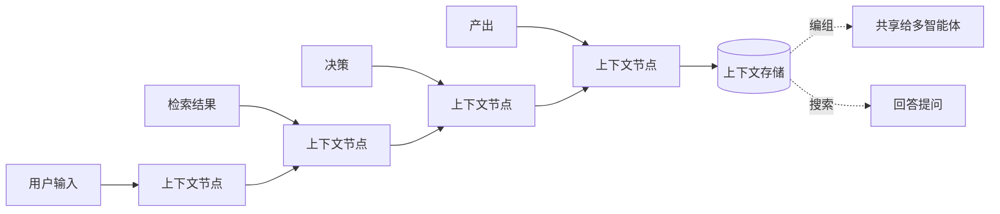

# 09 · AI 能力蓝图

> 原始图：[图/02-AI实现功能蓝图.png](图/02-AI实现功能蓝图.png)（手写稿）
> 本文件把手稿内容整理成可实现的规格。手稿中字迹不确定处已标注 `[存疑]`，不影响整体结构判断。

## 1. 手稿内容整理

### 1.1 Agent 循环（左侧）

```text
投 → 知识      （投喂：检索知识库、注入上下文）
做 → 产品      （执行：产出实际产物）
改 → 提升/总结 （复盘：改进 + 总结）
      ↓
    短 → 导航   （判定下一步方向）
```

三条支路构成 Agent 的基本循环，第四步"短 → 导航"是回环控制：判断下一步该投知识、该做产品，还是该改进。

### 1.2 Agent 流程（右上）

```text
发起 → 研究 → 实施 ⇄ 检验 → 产出
                        ↑______|
                     （回环）
```

- **发起**：明确目标和约束。
- **研究**：检索知识库、分析现状。
- **实施**：写代码 / 改配置。
- **检验**：验证；不通过**回环到实施**。
- **产出**：交付。

这个五步就是整合包"计划态 → 工作态 → 微调修正 → 汇报态"的内容逻辑。

### 1.3 三层结构 → 整体结构

```text
Agent 流程  →  3层结构  →  整体结构（公司级）
```

三层结构推导出公司级的整体结构。单 Agent 的流程规范，推广为整个组织的协作规范。

### 1.4 具体操作 → 询问

| 手稿条目 | 含义 |
|---|---|
| 询问（superpower）`[存疑]` | 询问即一种"超能力"操作入口 |
| 技能化（claude-my-opencode / 交相化）`[存疑]` | 把操作技能化、可移植 |
| 微细化拆分 | 把大问题拆到足够细，交给更小的执行单元 |
| 微调 | 局部精修，不重做 |

### 1.5 任务分发 / 协同

- **LLM 级分发**：由模型判断任务粒度，决定分给单个 Agent 还是多个。
- **多 Agent · 混合（时间回溯）**：多个 Agent 混合协作，允许时间回溯（回到之前的决策点重新分叉），而不是只能向前。

### 1.6 询问式文档 / Plan 模式增强

- **（推理态）咨询和讨论**：先讨论清楚再动手。
- **询问式文档**：文档不是写完就固定，而是可以被"询问"，答案随上下文变化。
- **Plan 模式增强**：计划不是静态文档，是可被质询和修订的对象。

### 1.7 动态文档



- **动态文档**：随工作过程实时变化。
- **人2传改 / 人2评论**：人机双向——人改文档，Agent 评论；人评论，Agent 接受。
- **Agents 整合**：多个 Agent 的产出整合进同一份文档。
- **动态展示**：文档本身就是展示面。

### 1.8 文本式破规定

| 手稿条目 | 含义 |
|---|---|
| 任务日志 = 明确进度 | 文本任务日志承担进度追踪 |
| 目标表 =（Agent 自查 交互） | 目标表由 Agent 自查驱动 |
| 修改文件和实现问的交付检验 | 改完文件要做交付检验 |

### 1.9 侧测试写代码 ⇄ 新建空间



- **TDD**：测试先行。
- **IDD**：接口/设计先行——先定接口和设计，再写实现。
- **新建空间**：每次任务在受控空间内进行（工作区 / 沙箱 / git 分支）。
- **指定 API / 指定输出**：任务可以显式指定调用的 API 和期望输出格式。

### 1.10 鼠标精灵

- **鼠标精灵** → **可视化展示 + 人化互动**。
- 拖动精灵 = 拖动上下文 / 拖动数据对象。精灵是"上下文手柄"。

## 2. 实现映射

| 蓝图能力 | 实现位置 | 状态 |
|---|---|---|
| Agent 循环（投/做/改/导航） | 整合包状态机的自环 | [04 §4.3](04-三大核心对象.md) |
| 五步流程（发起→研究→实施⇄检验→产出） | 整合包 `states` + 验证 hook | [03 §4](03-装载器与a2a规范.md) |
| LLM 级任务分发 | 分发器 | 本文件 §3 |
| 多 Agent 混合 + 时间回溯 | 协作引擎 | 本文件 §4 |
| 询问式文档 | 文档服务 | 本文件 §5 |
| 动态文档 + 人机双向 | 文档服务 | 本文件 §5 |
| 任务日志 / 目标表 | 工作台状态面板 | [10](10-工作台与项目管理.md) |
| TDD / IDD + 新建空间 | 任务执行器 + 文件管理器 | [03 §5](03-装载器与a2a规范.md) |
| 鼠标精灵 | 可视化界面 | [10 §5](10-工作台与项目管理.md) |
| 上下文链式存储 / 编组 | 上下文存储 | 本文件 §6 |

## 3. 任务分发

```ts
interface Dispatcher {
  /** 由模型判断任务粒度 */
  assess(task: Task, ctx: DispatchContext): Promise<DispatchDecision>;
}

interface DispatchDecision {
  strategy: "single" | "parallel" | "debate" | "hierarchical";
  /** LLM 级分发：按判断的粒度切分 */
  units: DispatchUnit[];
  rationale: string;
}

interface DispatchUnit {
  id: string;
  objective: string;
  dependsOn: string[];
  /** 该单元的智能体数量。1-3~5 智能体动态决策 */
  agentCount: number;
  /** 多智能体取一测试：互相争论后取一 */
  mode: "execute" | "debate-then-decide";
  workspace: string;            // 新建空间：独立工作区
}
```

- **LLM 级分发**：不写死规则，由模型根据任务复杂度决定用哪种策略。
- **1-3~5 智能体动态决策**：不是越多越好，由模型按任务性质定。
- **多智能体取一测试**：多个智能体独立作答，互相争论，最后取一。

## 4. 多 Agent 协同

### 4.1 动态智能体数量

```ts
interface AgentPoolSpec {
  min: 1;
  max: 5;                       // 1-3~5 动态决策
  /** 按什么维度分配智能体 */
  dimensions?: ("perspective" | "role" | "specialty" | "seniority")[];
  /** 数量确定规则 */
  sizing: (task: Task, ctx: unknown) => number;
}
```

### 4.2 时间回溯

```ts
interface CollaborationRun {
  runId: string;
  /** 回溯点：允许回到某个决策点重新分叉 */
  checkpoints: DecisionPoint[];
  timeline: TimelineNode[];
  /** 从某点回溯，产生新分支 */
  rewindTo(pointId: string, reason: string): Branch;
}

interface Branch {
  branchId: string;
  forkedFrom: string;
  /** 分支独立，失败不影响主干 */
  isolatedWorkspace: string;
}
```

- **时间回溯**不是撤销，而是**分叉**：回到某个决策点，尝试另一条路。
- 每个分支有**独立工作区**，互不污染。
- 主干和分支的产出都可被采纳，由汇报环节决定。

### 4.3 上下文记忆链式存储

```ts
interface ContextStore {
  /** 链式存储：上下文是有序链，不是无序集合 */
  append(entry: ContextEntry): ContextNode;
  /** 以编组形式共享上下文 */
  share(nodeIds: string[], groupId: string): ContextGroup;
  /** 动态搜索 */
  search(query: ContextQuery): ContextNode[];
  /** 随心问随心答，不打断当前工作 */
  ask(nodeIds: string[], question: string): Promise<Answer>;
}
```

- **链式**：上下文有先后，保留因果。
- **编组共享**：一次给多个智能体一组上下文，而不是各自复制。
- **动态搜索**：按需检索历史，不全量塞进上下文窗口。
- **不打断**：提问是旁路操作，不中断当前任务流。

## 5. 询问式文档与动态文档

```ts
interface LivingDocument {
  id: string;
  type: "plan" | "spec" | "task-log" | "goal-table" | "decision-log";
  /** 动态：内容随工作过程变化 */
  content: string;
  version: number;
  updatedAt: string;
  /** 可被询问 */
  askable: true;
  /** 人机双向 */
  revisions: Array<{
    by: "human" | "agent";
    kind: "edit" | "comment" | "accept" | "reject";
    ref: string;                // 指向段落/行
    at: string;
  }>;
  /** 多 Agent 产出整合 */
  sources: Array<{ agentId: string; ref: string }>;
}

/** Agent 自查驱动的目标表 */
interface GoalTable {
  goals: Array<{
    id: string;
    statement: string;
    status: "pending" | "in-progress" | "blocked" | "done";
    evidence?: string;          // 完成证据。Agent 自查必须有证据
    checkedBy: "agent" | "human";
    checkedAt?: string;
  }>;
}
```

- **可被询问**：文档不只被读，还被问。问的是当前上下文，答案随上下文变。
- **人2传改 / 人2评论**：人改文档、Agent 评论；人评论、Agent 接受。双向，不是单向生成。
- **Agent 自查必须有证据**：`evidence` 为空不算完成。

## 6. 上下文记忆链



## 7. TDD / IDD 与新建空间

```ts
interface TaskExecution {
  method: "TDD" | "IDD";
  /** 新建空间：每次任务在受控空间内进行 */
  workspace: {
    mode: "git-worktree" | "git-branch" | "sandbox" | "in-place";
    path: string;
    /** 任务结束后的归宿 */
    onComplete: "commit" | "merge" | "discard" | "checkpoint";
  };
  /** 指定 API：显式指定调用的接口 */
  apis?: string[];
  /** 指定输出：显式指定期望的输出格式 */
  outputFormat?: string;
  /** 交付检验：改完文件必做 */
  deliveryCheck: DeliveryCheck;
}

interface DeliveryCheck {
  typeCheck: boolean;
  unitTest: boolean;
  build: boolean;
  /** 无条件要求，不按等级追加 */
  auditTrail: boolean;
  rollbackReady: boolean;
}
```

- **TDD**：测试先行，先写测试再写实现。
- **IDD**：设计先行，先定接口再写实现。
- **新建空间**：任务在独立空间内进行（git worktree / 分支 / 沙箱），完成后再合并或丢弃。这是 TDD/IDD 敢用的前提。
- **指定 API / 指定输出**：任务边界显式声明，减少跑偏。
- **交付检验**：修改文件后必须过一遍检查链（对应手稿"修改文件和实现问的交付检验"）。

## 8. 鼠标精灵

```ts
interface CursorSprite {
  /** 精灵绑定什么 */
  bound: ArtifactRef | ContextNode | ComponentRef;
  /** 拖动时发生什么 */
  onDrag(target: DropTarget): DragResult;
  /** 可视化呈现 */
  render: "ghost" | "preview" | "live";
}

/** 人化互动：把上下文对象变成可拖、可看、可点的东西 */
interface HumanInteraction {
  pick: (region: ScreenRegion) => ArtifactRef;   // 框选屏幕 → 转为上下文
  preview: (ref: ArtifactRef) => Preview;         // 悬停预览
  drop: (ref: ArtifactRef, target: DropTarget) => void;
  explain: (ref: ArtifactRef) => string;          // 解释这是什么
}
```

- **精灵 = 上下文手柄**：拖动它就是把上下文拖进某个位置。
- **人化互动**：框选、悬停、拖放、点问——把"理解上下文"变成可视操作。
- **截图位置信息**必须保留（`ScreenRegion` 含全屏尺寸），否则精灵不知道自己在哪。见 [03 §6](03-装载器与a2a规范.md)。
