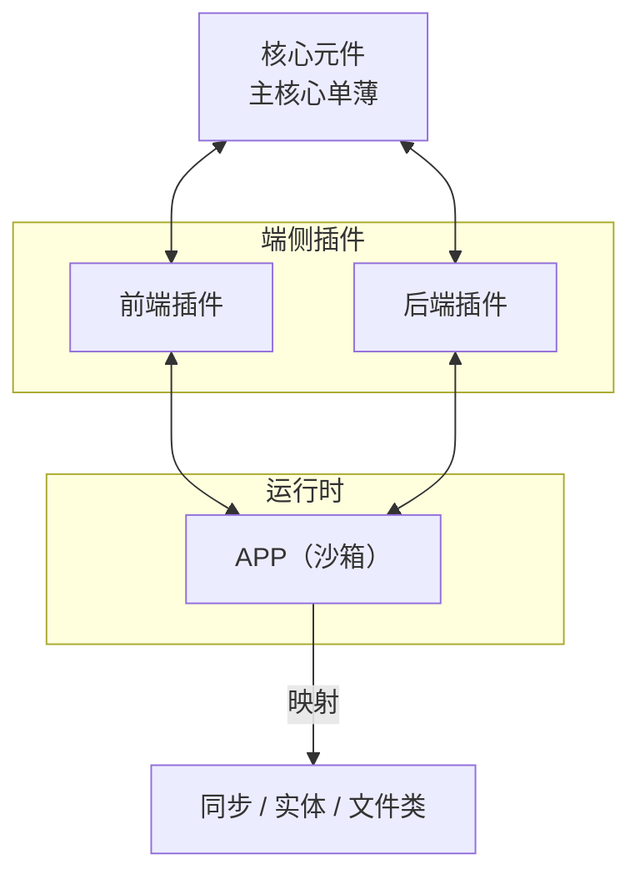
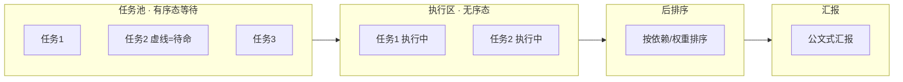

# 10 · 工作台与项目管理

> 原始图：[图/03-插件与端架构.png](图/03-插件与端架构.png)、[图/04-项目管理过程展示.png](图/04-项目管理过程展示.png)
> 原始素材：`插件逻辑/设计理念.md` §5

## 1. 核心元件与插件的关系



- **核心元件** = 平台底座（[02](02-平台底座-后端底层架构.md)）。主核心单薄，其余皆为插件。
- **APP（沙箱）**是插件的执行环境之一。插件在沙箱内运行，与核心元件通过映射通信。
- **同步 / 实体 / 文件类**：APP 内数据的映射目标，三种映射类型对应不同的同步语义。

> 设计约束：**核心元件不依赖任何插件**。拿掉全部插件，核心元件仍能启动（只是没有能力）。

## 2. 端分工

手稿给的是三块：**前端 / web 端 / 后端**。

| 端 | 职责 | 手稿条目 |
|---|---|---|
| **前端** | 显示、内容呈现 | ① AI 内容；② 可视化界面；③ 文本；④ **鼠标精灵** |
| **web 端** | 社区与集成 | ① 社区；② 插件；③ **前端插件**；④ **数据源** |
| **后端** | 能力供给 | ① 插件；② 环境；③ **账号**（cswitch）`[存疑]`；④ **版本** |

### 2.1 解读

- **前端 = 显示？** 手稿在"前端"旁打了个问号。对应本系统的答案：前端显示的是**可询问的动态内容**——不是静态渲染，是可以被点开、被追问的动态展示（见 [09 §5](09-AI能力蓝图.md)）。
- **web 端的数据源**：web 端是内容与社区的来源，其数据源通过云端套件接入（见 [05](05-云端套件双体结构.md)）。
- **后端插件 + 环境**：对应套件的云端端口 + 本地可视化插件双体结构。
- **账号**：**替代 ccswitch 这类外部代理**，让一个 Agent 可以同时使用多种模型。见 [§2.3](#23-账号多模型管理核心)。
- **版本**：所有对象都带版本 —— 插件、套件、整合包、知识条目、交接包。

### 2.2 模块化设计 + 全程日志埋点

手稿底部：**模块化设计 + 全程日志埋点**。

- **模块化**：功能以插件/套件为模块独立存在，跨模块只走接口。落实为目录结构 —— 核心部分一个文件夹，每个整合包一个文件夹，每个插件一个文件夹（见 [README](README.md)）。
- **全程日志埋点 = 模型路径可追踪**。全系统每一次模型调用都必须留痕，形成**可回放的完整调用链**。见 [§2.4](#24-全程日志埋点核心)。

### 2.3 账号（多模型管理，核心）

> **账号是用来替代 ccswitch 这类代理的，方便一个 Agent 可以使用多种模型。**

#### 2.3.1 定位

外部的 ccswitch 之类工具，靠人工改环境变量 / 改配置来切模型。本系统**内置**这个能力：账号在平台内管理，切换是运行时行为，不需要退出重启，也不依赖外部代理进程。

| | ccswitch（外部） | 平台内置账号 |
|---|---|---|
| 切换方式 | 改环境变量 / 改配置 | 运行时调用，可按请求粒度 |
| 生效时机 | 需重启进程 | 即时生效；已拉起的会话跑完为止 |
| 多模型并存 | 一次只能有一个生效 | 多个账号同时注册，按策略选 |
| 官方 / 中转 | 靠手改配置区分 | 账号自带 `kind`，选账号时一并确定 |
| 外部 CLI 通道 | 改 CLI 的配置文件 | **先检测注入情况，没用才注入**（`cli-profile`） |
| 可审计 | 无 | 每次选择都进日志埋点 |

> **ccswitch 由一个插件整体替代**：[插件/适配/relay-hub](../插件/适配/relay-hub/开发文档.md) 管「外面有哪些中转站」，本节的账号管「我现在用哪一个」。**不导入 ccswitch 的配置文件** —— 那是让平台依赖一个要被替代的东西。

**`kind` 为什么在核心**：账号决定「怎么到达」。官方直连 API 就到得了；中转**得先把配置注入到外部 CLI**，那份 CLI 才读得到。这条差异是硬的，而且是账号自己的属性 —— 插件拿不到这个信息。所以 `kind` 跟着账号走最省一层。

**`kind` 不决定套不套家族适配器。** 这条容易在后来被当成漏改，所以说明白：中间层重写字节的风险，对第三方中转、对平台自己的网关、对任何中间代理**一视同仁**。按账号类型分流防不住任何东西，只会给人「中转已被处理过」的错觉。防护在 [02 §3.2](02-平台底座-后端底层架构.md) 的网关透射性契约和有损字段显式标出 + 埋点可审。

#### 2.3.1.1 中转账号的三条处理

| 情况 | 行为 |
|---|---|
| 账号 `kind: "relay"` 且填了 `relayBaseUrl` | 可用。走 API 直连该站；走 CLI 通道时**先 `detect()` 再决定要不要注入** |
| 账号 `kind: "relay"` 但没填 `relayBaseUrl` | 账号可用于 API，**不可用于 CLI 通道** —— 没有端点就无从注入 |
| 从中转站物化来的账号 | `relay-hub.originOf()` 能反查回站和模型别名 |

**模型名可能是站改过的**。中转挂一个 `claude-opus-5-5` 的名，背后未必是同名模型。`RelayStation.models[].alias/upstream` 就是干这个的 —— 站侧叫什么、平台侧叫什么，一一对齐。名字对不上时 `accepts()` 拒绝并说明原因，**回落 API，不猜**。

#### 2.3.2 关键能力

- **多账号并存**：同时注册多个模型账号/供应商凭据，运行时按策略选择。
- **按任务选模型**：整合包可以声明"规划用 A、编码用 B、审查用 C"。
- **凭据隔离**：凭据只存在平台内，经 `CredentialRef` 调用，不进上下文、不进日志明文。
- **切换留痕**：每次账号/模型选择写进日志埋点，构成模型路径的第一段。

#### 2.3.3 契约

```ts
interface ModelAccount {
  id: string;
  label: string;                    // "主力-便宜" / "主力-强推理"
  provider: string;                 // 供应商或中转站 id
  /** 决定怎么到达：官方直连 API，还是经中转站 */
  kind: "official" | "relay";
  /** 中转必须显式填；官方留空。缺失时中转账号不可用于 CLI 通道 */
  relayBaseUrl?: string;
  /** 结构化引用，不是裸 string。裸 string 会被误当路径或 URL 处理 */
  credentialRef?: CredentialRef;
  /** 凭据可能不止一把（主用 + 备用）。有备份时优先用第一把 */
  credentialRefs?: CredentialRef[];
  models: string[];                 // 该账号可用的模型
  capabilities?: SuiteCapability[]; // 部分账号兼作套件
  priority: number;
  limits?: { rpm?: number; tpm?: number; concurrency?: number };
  health: "unknown" | "healthy" | "degraded" | "disabled";
}

/** 选模型策略。策略本身可被整合包覆盖 */
interface ModelSelectionPolicy {
  byTaskKind?: Record<string, string[]>;   // 任务类别 → 候选账号 id 有序列表
  fallback: "first-healthy" | "round-robin" | "lowest-cost";
  onAllUnhealthy: "degrade" | "fail";
}

interface AccountManager {
  list(): ModelAccount[];
  register(account: ModelAccount): void;
  /** 选账号。每次选择都写日志埋点 */
  select(taskKind: string, ctx: SelectContext): Promise<SelectionRecord>;
  healthCheck(id: string): Promise<HealthReport>;
}

interface SelectionRecord {
  accountId: string;
  model: string;
  /** session = 该会话显式覆盖了账号（见 §2.3.3.1） */
  reason: "session" | "policy" | "fallback" | "override" | "health";
  at: string;
  traceId: string;                  // 关联到日志埋点的模型路径
  /** reason 为 "session" 时必填：是谁覆盖的 */
  sessionId?: string;
}
```

**`reason` 加 `"session"` 这一档是必须的，不是可选的。** 不加的话，会话级覆盖在 `target-resolve` 里生效了，埋点却记成 `"policy"`，审计时看不出是谁覆盖的 —— 「可追踪 > 便利性」这条就在这儿破。

#### 2.3.3.1 会话级覆盖

`SessionRef.accountOverride` 允许一个会话单独指定模型账号，A 会话切账号不影响 B 会话。优先级链：

```text
会话显式覆盖  →  整合包 profile  →  ModelSelectionPolicy  →  fallback 链
```

会话级覆盖**高于整合包 profile，低于用户全局显式指定**。理由：整合包 profile 是模式的默认值，会话级是用户在**这一个具体场景**下做的选择；全局显式是用户对这个系统的整体指定，压过局部更合理。

`target-resolve` 的 `Target.decidedBy` 联合类型（[12 §1.3.4](12-TypeScript接口契约.md)）是**另一套并行枚举**，加这一档时两处必须一起改，漏一处会静默降级。

完整定义见 [12 §1.4](12-TypeScript接口契约.md)。

#### 2.3.4 凭据链

> `credentialRef` 是悬空引用时，账号就是「一个指向不明处的字符串」—— 下游只能当它不存在，或者更糟，当路径用。

```ts
type CredentialRef = string & { readonly __brand: "CredentialRef" };

/** 不可字符串化。唯一出口是 use() 或 burnInto()，两者都可 grep */
interface SecretHandle {
  use<T>(fn: (secret: string) => T): T;
  /** 供 child_process.env、EnvPatch 这类必须拿到 Record<string,string> 的窄口 */
  burnInto(map: Record<string, string>, key: string): void;
  toString(): "[redacted]";
  toJSON(): undefined;             // JSON.stringify 打不进日志
}

interface CredentialStore {
  put(secret: string, meta: { label: string; accountId: string }): Promise<CredentialRef>;
  resolve(ref: CredentialRef): Promise<SecretHandle>;   // 取不到 → 抛
  health(): Promise<{ available: boolean; backend: string; reason?: string }>;
  rotate(ref: CredentialRef): Promise<void>;
  revoke(ref: CredentialRef): Promise<void>;
  list(): Promise<Array<{ ref: CredentialRef; label: string; accountId: string }>>;
}
```

**TypeScript 拦不住字符串被复制**，目标是让泄漏路径**窄且可 grep**，不是绝对禁止：`toJSON` 返回 `undefined`、`toString` 返回 `[redacted]`、只有两条显式出口。grep `use(` 和 `burnInto(` 就能列出所有凭据真正离开过的地方。

**注入要用凭据，所以这不是注入链的附属品。** `cli-profile` 要往 CLI 的环境变量里写 key（`burnInto`），`detect()` 要比对「是不是同一把 key」（比 `keyHash`）。凭据链是注入链的底座。

#### 2.3.5 取不到凭据怎么办

**不是拒启整个系统。** 底座的验收是「空配置能起来」，硬拒启会打破它。准确说法是**拒绝进入可运行（模型可用）状态**：

```text
resolve() 抛
  → AccountManager 把该账号标 degraded
  → ModelSelectionPolicy 按 fallback 换号
  → 全部不可用时该次模型调用失败，但不需要模型的工具照常跑
```

走的是已有的健康度机制，不是新增一条旁路。

**`revoke` 对已拉起的进程完全无效** —— 凭据在 spawn 时就烧进环境变量了。常驻的 CLI 会话把这个缺口放大了：撤销之后，老 CLI 会话还能继续用那把 key 直到它自己退出。**处置是说清楚，不是假装能撤**：告诉人这把 key 要等 CLI 会话退干净才真正失效，必要时手动终止该 CLI 会话。

#### 2.3.6 与伪装层的关系

账号管理在 agent 层之上（决定"调谁"），转化器在网络层之下（决定"怎么调"）。两者解耦：换账号不换转化器，换转化器不换账号。

```
整合包 profile  →  ModelSelectionPolicy  →  AccountManager 选出账号+模型
                                              ↓
                                        Transformer 选转化器（渠道亲和）
                                              ↓
                                        网络层：代理 / IP池 / 供应商切换
```

### 2.4 全程日志埋点（核心）

> **全程日志埋点，指的是模型路径可追踪。**

#### 2.4.1 硬要求

**全系统每一次模型调用都必须留痕**，形成从用户输入到最终产出的**完整可回放调用链**。这不是可选的可观测性，是**架构要求**。

必须能回答的问题：

1. 这次任务用了哪些模型？每个环节分别是谁？
2. 每个模型调用前后的完整输入输出是什么？
3. 中间经过了哪些转化器、哪个渠道、哪个出口 IP？
4. 哪些内容来自检索？引用了哪些制品？
5. 中间是否发生交接？交接给谁、传了什么？
6. 用户的人工修改在哪个节点介入？

#### 2.4.2 模型路径

```
用户输入
  → 输入转化器(清洗)
  → [模型调用 #1] 账号A/模型X  ← 记录 selection
  → 任务分发器
  → [模型调用 #2] 账号B/模型Y
  → 上下文链写入
  → 检索(知识库套件)          ← 记录 artifactRefs
  → [模型调用 #3] 账号A/模型X
  → 转化器 outbound → 渠道
  → 转化器 inbound  → 结构化数据
  → 产出
```

一次任务 = 一条 `Trace`，由多个 `Span` 组成，Span 之间父子嵌套。

#### 2.4.3 契约

```ts
interface Trace {
  traceId: string;
  /** 用户的对话线程（SessionRef）。不是 CLI 会话、不是 MCP 线程、不是浏览器会话 */
  sessionId: string;
  packageId: string;
  startedAt: string;
  endedAt?: string;
  spans: Span[];
  /** 完整回放：按时间序的每一步 */
  replay(): ReplayStep[];
}

interface Span {
  spanId: string;
  parentSpanId?: string;
  /** 跨 Trace 的父链。跨会话派活用这一条，parentSpanId 只管同一条 Trace 内的嵌套 */
  parentTraceId?: string;
  kind: "input" | "model" | "tool" | "retrieval" | "transform" | "network" | "handoff" | "dispatch" | "human-edit";
  startedAt: string; endedAt?: string;
  /** 模型调用 span 必填 */
  model?: {
    accountId: string; model: string;
    selection: SelectionRecord["reason"];
    promptRef: string; completionRef: string;   // 引用，不在日志里存明文
    tokens: { input: number; output: number };
  };
  /** 网络 span 必填 */
  network?: { channel: string; transformerId: string; ipRegion: string; cached: boolean };
  /** 检索 span 必填 */
  retrieval?: { suiteId: string; query: string; artifactRefs: string[]; recall?: number };
  /** 交接 span 必填 */
  handoff?: { handoffId: string; from: string; to: string };
  /** 跨会话派活 span 必填（B 侧也记一条，两边互指） */
  dispatch?: {
    ticketId: string;
    from: string; to: string;          // 会话 id
    targetTraceId: string;             // 对端那条 Trace 的 id
    depth: number;
    status: "pending" | "running" | "done" | "failed" | "cancelled" | "rejected";
    /** 回传注入本会话上下文时标出来源，让「这段内容是哪个会话产的」可查 */
    returnedFrom?: string;
  };
  error?: { code: string; message: string };
}
```

#### 2.4.4 落地要点

- **底座强制**：日志埋点是**底座能力**，不是插件。所有走模型调用的路径**没有旁路**——想不记录就没有这个接口。
- **全量无条件**：没有档位。一次任务一条完整 `Trace`，谁在什么时候改了什么，全部在链上。性能与链路追踪的**采样率、保留时长、导出目标**是**可观测性配置**（部署时定），不是按等级开关的开关。
- **脱敏**：凭据、个人信息在写入前脱敏；脱敏规则本身版本化受控，规则版本进 `Trace` 元数据。
- **与交接联动**：交接事件与 trace 关联，跨模式追踪不中断（见 [06 §7](06-模式衔接与交接协议.md)）。
- **跨会话派活记 `dispatch` span，两边各记一条**。见下。

**跨会话不串 span，这条容易被当成漏做，所以说明白。**

`parentSpanId` 只能串**同一条 `Trace` 内的** span —— 跨 `Trace` 它无路。跨会话派活把 B 的 span 塞进 A 的 `Trace`，会让 A 的上下文里混进 B 的整个执行过程：A 的下一步该检索什么、该调什么模型，都会受 B 的过程影响，而且 A 的 trace 再也读不出「A 这次到底做了什么」。

所以做法是**两条独立的完整 Trace + 一条父链指针**：

```text
A 的 Trace  ── span(kind:"dispatch", targetTraceId: B) ──┐
                                                        │ parentTraceId
B 的 Trace  ── span(kind:"dispatch", targetTraceId: A) ←─┘
```

**让掉的是"合并成一棵树"，不是"记录"。** B 侧的每一次模型调用照样全量无条件记录，**B 的 trace 一样完整可回放** —— 「模型路径可追踪」和「没有旁路」两条一步没退。退掉的只是 A 的 trace 里不再展开 B 的细节。

**回传内容可归因**：B 的结论注入 A 的上下文时，A 侧那条 span 记 `returnedFrom: B`，且 B 侧 `targetTraceId` 可查。所以 [§2.4.1](#241-硬要求) 第 1 问「这次任务用了哪些模型」在跨会话场景下仍有答案 —— A 的答案加 B 的 trace，链是通的，只是分两条。

### 2.4.5 会话与 trace

一次任务通常等于一个会话里的一段，但**不是同一个东西**：会话是容器的生命周期，trace 是一次执行的记录。同一会话可以有多条 trace（派活出去两次），一条 trace 也可以为空（用户开了会话没干活）。`Trace.sessionId` 是「这次执行属于哪个会话」，不是「这次执行等于哪个会话」。

跨会话派活产生 N 条 trace，关系记在 `DispatchTicket.parentTicketId` 与 `Span.parentTraceId` 两处，见 [12 §8.2](12-TypeScript接口契约.md)。

## 3. 工作台三种形态

### 3.1 项目制管理

| 时相 | 内容 |
|---|---|
| **平时状态** | 项目启动管理 |
| **执行过程** | 项目式管理，状态分为管理时间轴：讨论态 / 计划态 / 工作态 / 微调修正 |
| **汇报状态** | 类公文式汇报；CI |

- **平时状态**：项目还没启动或已结束，管理启动入口和项目集合。
- **执行过程**：四态时间轴，状态可回退（工作态发现问题回计划态）、可并行（多个独立任务同时工作态）。
- **汇报状态**：公文式汇报 + CI 集成。

### 3.2 对话式管理

| 能力 | 说明 |
|---|---|
| **侧边讨论** | 主任务进行中，旁路讨论不打断 |
| **截图式同步** | 保留截图位置信息：**全屏信息 + 截图位置** |
| **结束总结式** | 对话结束时给总结 |

- **侧边讨论** = [09 §6](09-AI能力蓝图.md) 的"不打断、随心问随心答"。
- **截图位置信息**是硬要求：全屏宽高 + 截图区域坐标，见 [03 §6](03-装载器与a2a规范.md) 的 `StructuredInput.viewport`。

### 3.3 助手式管理

| 能力 | 说明 |
|---|---|
| **只保留基础问答** | 不做复杂编排，只做问答 |
| **状态汇报** | 简报式状态 |

助手式是三个形态里最轻的，对应 `voice-assistant` 这类以收集信息为主的整合包。

## 4. 过程性展示

> 原始图：[图/04-项目管理过程展示.png](图/04-项目管理过程展示.png)

手稿画的是四段：**任务池（有序态等待） → 执行（无序态） → 后排序 → 汇报**。



| 阶段 | 特征 | 实现含义 |
|---|---|---|
| **有序态等待** | 任务有稳定顺序（实线=已就绪，虚线=待命/未就绪） | 任务池按依赖和优先级排队；虚线表示前置未完成 |
| **无序态执行** | 任务并行且**不保证顺序** | 独立任务同时跑；结果到达顺序 ≠ 开始顺序 |
| **后排序** | 执行完再排序 | 按依赖关系、权重、失败重试次数做拓扑排序 |
| **汇报** | 公文式汇总 | 按 [§5](11-设计理念与硬性约束.md) 的三段式输出 |

### 4.1 为什么执行无序、汇报有序

因为**任务之间多半没有依赖**。强制按序执行会浪费时间，强制按序汇报会误导。

```
有序（入池）→ 无序（执行，最大化并行）→ 有序（汇报，最小化困惑）
```

- **执行无序**最大化吞吐：能同时跑就同时跑。
- **汇报有序**最小化困惑：用户看到的顺序永远符合依赖关系。

### 4.2 任务池

```ts
interface TaskPool {
  tasks: TaskRecord[];
  /** 入池时排序：依赖优先，然后优先级 */
  admit(task: Task): void;
}

interface TaskRecord {
  id: string;
  objective: string;
  dependsOn: string[];
  priority: number;
  status: "waiting" | "ready" | "running" | "done" | "failed" | "blocked";
  /** 是否独立任务。独立任务可无序并行 */
  independent: boolean;
  workspace: string;            // 新建空间
  startedAt?: string;
  finishedAt?: string;
  result?: TaskResult;
}

/** 后排序：按依赖拓扑 + 权重 */
function orderForReport(tasks: TaskRecord[]): TaskRecord[] {
  const done = tasks.filter(t => t.status === "done" || t.status === "failed");
  // ① 依赖拓扑序；② 同层内按 priority 降序；③ 失败项附在相关成功项之后
  return topoSort(done, t => t.dependsOn)
    .flatMap(node => sortBy(node, t => -t.priority));
}
```

### 4.3 汇报态

见 [11 §2](11-设计理念与硬性约束.md) 的公文式三段式汇报。任务池的排序结果直接作为汇报的章节顺序。

## 5. 可视化与人化互动

- **可视化展示 + 人化互动**（手稿"鼠标精灵"）：见 [09 §8](09-AI能力蓝图.md)。
- **动态展示**：文档本身就是展示面，见 [09 §5](09-AI能力蓝图.md)。
- **可视化界面 + 文本 + AI 内容**（前端三件套）并存：同一个对象可以有图形呈现和文本呈现，按场景切换。

## 6. 工作台形态与整合包的映射

| 工作台形态 | 主用整合包 | 辅助整合包 |
|---|---|---|
| 项目制 | `code-development` `project-monitor` | `design-to-code` |
| 对话式 | `code-development`（侧边讨论态） | `voice-assistant` |
| 助手式 | `voice-assistant` | — |

**工作台形态是界面视角，整合包是能力视角。** 同一个整合包可以在不同形态下使用；同一个形态可以承载多个整合包。二者不正交强绑定。
