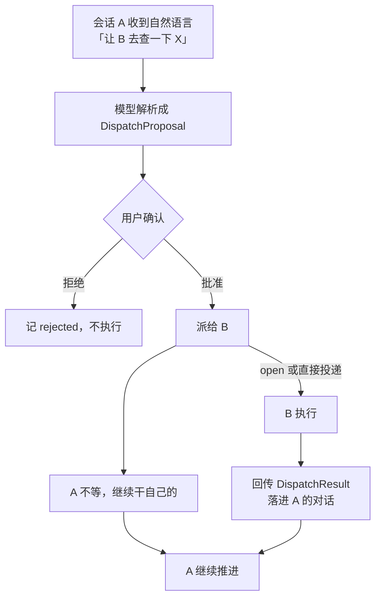

# 插件 · 跨会话调度

| 项 | 值 |
|---|---|
| `id` | `session-hub` |
| 所属分类 | 协作 |
| 风险级别 | elevated（需确认） |
| 依赖插件 | `dispatch-llm`、`agent-pool` |
| 状态 | ⬜ 待开发 |

## 1. 目标

让**用户可以在会话 A 里说一句「让 B 去干这个」，B 是另一个用户可见的会话。**

本文件里「会话」只有一个意思：**用户的对话线程**（`SessionRef`）。外部 agent CLI 那个进程级的常驻会话，类型名是 `CliSession`、中文一律叫**「CLI 会话」**，两者不要混用。

B 是**另一个用户可见的会话**：有独立面板、独立整合包、独立工作区、独立语言。它不是子智能体，也不是后台进程 —— 屏幕上有一块地方一直亮着，用户随时能切过去看它在干什么。



**A 不等 B。** 派出去就撒手，A 该干嘛干嘛。B 干完把结论**回传进 A 的对话**，A 那一轮结束时已经看得到。

**整合包可以在会话内切换挂载。** `SessionRef.packageId` 是会话级属性，换挂载走 [06 的交接协议](../../../开发文档/06-模式衔接与交接协议.md)（`switchPackage()` 返回 `HandoffEnvelope`），不走另起炉灶的一套。

### 与同域已有插件的分工

这三者都叫「分派」，但拆的是不同的东西。**不说清楚就会被合并掉。**

| 插件 | 拆的是什么 | 产物回哪 |
|---|---|---|
| [../dispatch-llm](../dispatch-llm/开发文档.md) | 一个**任务内部**怎么分（single/parallel/debate） | 同一个会话 |
| [../agent-pool](../agent-pool/开发文档.md) | 起几个 agent、起在哪 | 内部资源，用户看不见 |
| **`session-hub`** | 派给**另一个用户可见的会话** | 另一个会话，有独立面板 |

判据是**产物落在哪里**：落在同一个会话里的是 `dispatch-llm` 的活；落在屏幕上看不见的内部资源里的是 `agent-pool` 的活；落在**另一个面板**里的才是本插件的活。

## 2. 归属理由

**不进核心。** 核心不依赖插件；拿掉本插件，系统照常启动，只是少这一项能力。

**拿掉它系统还能不能跑**：**能。** 退回单会话 —— 所有活都在当前会话里干，没有跨会话能力而已，没有任何功能坏掉。核心只持有会话容器（`SessionRef`），不持有调度逻辑。

**复用，不重复造。** 本插件的边界是「派到另一个会话」。它踩到但**不重新实现**的两块：

| 复用谁 | 复用它的什么 | 边界在哪 |
|---|---|---|
| [../dispatch-llm](../dispatch-llm/开发文档.md) | **任务粒度判断**与 `rationale` 必填的规矩 | 它答「这活该不该拆」；本插件答「拆出来的活派给谁」 |
| [../agent-pool](../agent-pool/开发文档.md) | **资源分配**、agent 起在哪、上下文编组 | 它管内部资源池；本插件管的是一块用户看得见的面板 |

**`action-authorize` 不在 `requires` 里，这是刻意的。** 跨工作区写要过它的闸门，但它是**操作域**插件 —— 协作域硬依赖操作域会破坏域间分层，而且它可以被单独禁用。缺失时本插件的行为是**拒绝跨工作区写**（见 §9），不是放行。**闸门不可用时一律拒绝，这条和 `action-authorize` 自己的降级规则一致。**

## 3. 清单

```ts
import type { PluginManifest } from "@core/types";

export const manifest: PluginManifest = {
  id: "session-hub",
  version: "0.1.0",
  description: "跨会话派活：A 说一句，另一个用户可见的会话 B 去干，干完把结论回传进 A。A 不等 B。",
  capabilities: [/* 见 §4 */],
  permissions: ["fs:read"],
  requires: ["dispatch-llm", "agent-pool"],
  riskLevel: "elevated",
  healthCheck: { command: "node -e \"require('./dist')\"", timeoutMs: 3000 },
};
```

## 4. 接口契约

```ts
// 生命周期
- `open(opts) => SessionRef`            // 自然语言拉起也走这里
- `close(sessionId, reason) => void`
- `list(filter?) => SessionRef[]`
- `switchPackage(sessionId, packageId) => HandoffEnvelope`   // 复用 06
- `setLocale(sessionId, locale) => void`

// 读：完全互通
- `history(sessionId, range?) => Message[]`
- `artifacts(sessionId) => ArtifactRef[]`
- `status(sessionId) => SessionStatus`

// 派活
- `parse(intent, from) => DispatchProposal`   // 模型解析成结构化，不直接执行
- `dispatch(proposal) => DispatchTicket`
- `chain(ticketId) => DispatchTicket[]`       // 链式
- `cancel(ticketId) => void`
- `tickets() => DispatchTicket[]`

// 回传
- `setReturnPolicy(sessionId, policy) => void`  // 用户可开关
- `onReturn(cb) => void`
```

**契约要求**：
- 输入输出用 `SchemaRef` 声明，运行时校验
- 失败时抛 `PluginError`（带 `code`），由装载器捕获，**不上抛到主循环**
- 能力被单独关掉时，其余插件不受影响

```ts
interface DispatchProposal {
  toSessionId?: string;      // 不给 = 按 spawn 新建
  spawn?: { title: string; packageId?: string; workspaceId?: string; locale?: LocaleRef };
  task: string;
  readOnly: boolean;         // 跨工作区时：true 读免确认，false 走授权闸门
  maxDepth: number;          // 还能往下派几层，默认 0
  /** 本次派活已经经过的会话链，防环用。maxDepth 挡不住 A→B→A→B→A */
  ancestorSessions: string[];
  rationale: string;         // 必填
}

interface DispatchTicket {
  ticketId: string;
  fromSessionId: string;
  toSessionId: string;
  parentTicketId?: string;   // 链式
  depth: number;             // 上限 3
  /** 本次派活已经经过的会话链，防环。两条都要查：会话级 + trace 级 */
  ancestorSessions: string[];
  ancestorTraceIds: string[];
  traceId: string;           // 派活方 A 侧的 trace
  parentTraceId: string;     // 承接方 B 侧的 trace
  status: "pending" | "running" | "done" | "failed" | "cancelled" | "rejected";
  returnPolicy: "on-completion" | "never";
  result?: DispatchResult;
}

interface DispatchResult {
  conclusion: string;        // 结论
  artifacts: ArtifactRef[];  // 产出引用，不是全文
  sessionId: string;         // 想看过程自己 read
  /** 回传没送出去时必须说出口。关着回传不等于静默失败 */
  undelivered?: { reason: "return-off" | "session-gone" | "declined"; note: string };
}
```

## 5. 关键约束

**这几条不写会被下一个人「优化」掉。**

- **派活是异步的，A 不等 B。** 回传是 `DispatchResult` 落在 A 的对话里，不阻塞 A。实现上任何「派完等结果再继续」的写法都是 bug。

- **`parse` 与 `dispatch` 必须分开。** 模型只能产出 `DispatchProposal`，不能直接调 `dispatch`。中间过一次 `SchemaRef` 校验 + 用户确认 —— 防的是模型被诱导去派活。

- **链式上限 `maxDepth: 3` + 环检测。** 环检测查**两个维度**：会话级（`ancestorSessions` 里有同一会话）和 trace 级（`ancestorTraceIds` 里有同一 trace）。**只查深度不够** —— A→B→A→B→A 在 3 跳之内完全合法，只会把预算用光。另外 `dispatch()` 校验 `to ≠ from`，且**只有链的末端会话能继续派**。

- **回传关了要说出口。** `returnPolicy: "never"` 时 B 照常干活，但 `DispatchResult.undelivered` 必须填。「B 干完了但 A 不知道」是静默失败，违反 [11 §4](../../../开发文档/11-设计理念与硬性约束.md) 的「降级要可见」。

- **跨工作区按读写分。** `readOnly: true` 免确认；`false` 走 [../操作/action-authorize](../../操作/action-authorize/开发文档.md) 的 `policy("cross-workspace-write")` 新 domain，**不新开一套闸门**。

- **回传只带结论 + 产出引用**，不带 B 的完整过程。要过程 A 自己 `history()` 拉 —— **互通是在读权限上给的，不是在回传内容上给的。**

- **自然语言拉起新会话**：用户在 A 里说「开个新对话查一下 X」→ 模型输出 `DispatchProposal` 且 `toSessionId` 为空、填 `spawn` → 用户确认 → `open()` → **立刻返回新 `SessionRef` 并在 UI 上开面板**。

- **与 `PlanApproval.onApproved: "spawn-subagent"` 区分。** 那个（[11 §3.1](../../../开发文档/11-设计理念与硬性约束.md)）是**内部子智能体**，不在 UI 上是独立会话。这个是**用户可见的独立会话**。两者都叫「派活」，接口不一样、权限不一样、埋点不一样，不要合并。

## 6. 「完全互通」的三个边界

「完全互通」听起来很危险，其实危险的地方很具体。以下三条**写死**。

**1. 互通是对话层，不是文件系统层。**

A 读的是 `history()` 和 `artifacts()` —— 后者返回**引用**，不是内容。A 想读 B 工作区里的文件，走 **A 自己的 `fs:read` 权限** + 跨工作区读规则（免确认）。**两件事不能混成一条路径。**

**2. 凭据永远不可跨会话读。**

这不是新加的限制，是本来就没有的通道：`SecretHandle` 只有 `use()` / `burnInto()` 两条出口，凭据在 spawn 时就烧进环境了，**从来就没进过对话内容**。所以「A 读 B 的历史」这条路上本来就没有凭据可读。不是靠本插件挡住的，是结构上不存在这条路。

**3. 完全互通 + 云端模型 = B 的内容会出网。**

A 把 B 的历史读进自己上下文后，下一次模型调用就带着 B 的内容发给当前账号。[../记忆/mem-profile](../../记忆/mem-profile/开发文档.md) 的「敏感字段不出网」管的是**网络出口**，管不到这里。

处置：界面上明示「以下内容来自会话 B，随下一次模型调用发出」，并记一条 span。**不阻断，但必须让人看见。**

## 7. 埋点

[10 §2.4.3](../../../开发文档/10-工作台与项目管理.md) 的 `Span.kind` 有 `"dispatch"`，派活这件事在 **A 的 trace 里是完整一条 span**，`parentTraceId` 指向 B 的 trace。

**跨会话不串 span** —— 不把 B 的 span 塞进 A 的 trace 里污染 A 的上下文。但 B 侧的模型调用**照样全量记录**，「模型路径可追踪」这条不让。

## 8. 权限

| 权限 | 理由 | 必需 |
|---|---|---|
| `fs:read` | 读 B 的 `artifacts()` 摘要与 `history()` 落盘内容 | 是 |

**实际可用 = 本插件声明 ∩ 整合包授权。** 本插件多声明无效。

**为什么不加 `"session:read"`。** `Permission` 现有六个（`fs:read` / `fs:write` / `net` / `process` / `device` / `clipboard`），本插件只声明 `fs:read`。

用户选的是**完全互通**，不是「可配置互通」。加一个整合包能拒绝的权限，等于凭空造一份用户没要过的配置面 —— 一个没人要求过的开关。真要收紧收到 [../操作/action-authorize](../../操作/action-authorize/开发文档.md) 的 policy 里做，那里才是配置面。

**这条要写明，否则下一个人会「补上这个缺失的权限」。**

## 9. 降级策略

| 情况 | 行为 |
|---|---|
| 目标会话已关闭 | 派活**失败并报出**，问用户是否按 `spawn` 新建一个，**不静默改派** |
| 目标会话在同一张派活链上 | **拒绝**，报出成环路径 |
| 超过 `maxDepth` | **拒绝**，报出当前深度与上限 |
| 跨工作区写被拒 | B 侧**停下来**并回传「被拒 + 拒因」，**不自行降级成只读** |
| 目标整合包未装载 | 派活**失败并报出**缺哪个插件，**不换个近似的顶上** |
| B 执行失败 | `status: "failed"`，回传失败原因与已完成到哪一步 |
| 回传时 A 已关闭 | 结果落 B 侧留存，**下次 A 打开时可见**，不丢；`undelivered.reason = "session-gone"` |
| 回传开关关着 | B 照常干活，但 `undelivered.reason = "return-off"` **必须填** —— B 自己的汇报里要标「未回传，原因：接收方关闭」 |
| `parse` 产出不合 schema | **拒绝并要求模型重来一次**；再来一次还不行就报错，**不猜、不手补字段** |
| 用户在确认环节拒绝 | 记 `rejected` 进票据列表，**不重复追问** |

**通用原则**：降级必须可见。不可用就是不可用，用户要知道原因。

## 10. 验收

- [ ] **派活是异步的，A 不阻塞** —— 派出去之后 A 继续推进自己的任务
- [ ] 回传开关 `setReturnPolicy(sessionId, "never")` **真的能关**；关掉后 B 干完 **A 那边收不到**，但 **B 侧的 `DispatchResult.undelivered.reason = "return-off"` 必填** —— 不许两边都一声不吭
- [ ] **`readOnly: true` 与 `readOnly: false` 走的是不同路径** —— 前者免确认，后者必须过 `action-authorize` 的 `policy("cross-workspace-write")`
- [ ] **模型只能产出 `DispatchProposal`，不能直接调 `dispatch`** —— 试图跳过 `parse` 的调用被拒
- [ ] `rationale` 缺失的 `DispatchProposal` 被拒
- [ ] 链式深度超过 `maxDepth: 3` 被拒
- [ ] **A→B→A 被拒**并报出成环路径（`ancestorSessions` 命中）
- [ ] **trace 维度成环也被拒**（`ancestorTraceIds` 命中，会话名不同但 trace 重复）
- [ ] `dispatch()` 拒绝 `to === from`；非链末端会话发出的派活被拒
- [ ] **`parentTraceId` 能从 A 的 trace 跳到 B 的 trace**，B 侧的模型调用 span 全量保留
- [ ] B 的 span **没有**被塞进 A 的 trace
- [ ] **自然语言拉起新会话**（「开个新对话查 X」）：`toSessionId` 为空 + `spawn` 有值 → 确认 → UI 上真的开出一个新面板
- [ ] **回传只带结论 + `ArtifactRef` 引用**，不带 B 的完整过程
- [ ] 读 B 工作区文件走的是 **A 自己的 `fs:read`**，不是混进 `history()` 通道
- [ ] **凭据不跨会话可读** —— A 拉 B 的历史里没有任何 secret material
- [ ] 界面明示「以下内容来自会话 B，随下一次模型调用发出」
- [ ] **拿掉本插件退回单会话**，其余插件正常
- [ ] 会话内切整合包走 06 交接协议，`switchPackage()` 返回可校验的 `HandoffEnvelope`

- [ ] 全部操作进日志埋点（模型路径可追踪）
- [ ] 单独装载本插件成功，单独禁用后其余正常
