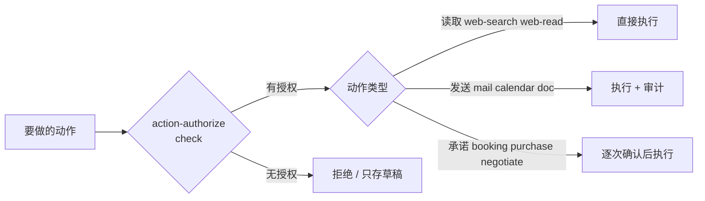

# 操作域

> 14 个插件，负责**对外做事**。全部要先过 [action-authorize](action-authorize/开发文档.md)。
> 本域是唯一会出现 `privileged` 的常规域 —— 花钱、对外发言、不可逆承诺。

## 1. 两条路径

同一件事有两种做法，**风险和降级路径完全不同，所以拆成不同插件**：

| | 屏幕路径 | 接口路径 |
|---|---|---|
| 靠什么 | 看屏幕 + 点坐标 | 调 API / 调 MCP |
| 插件 | [computer-use](computer-use/开发文档.md)、[app-gui](app-gui/开发文档.md)、[browser-open](browser-open/开发文档.md)、[browser-act](browser-act/开发文档.md) | [web-search](web-search/开发文档.md)、[web-read](web-read/开发文档.md)、[mail-send](mail-send/开发文档.md)、[calendar-mgr](calendar-mgr/开发文档.md)、[doc-create](doc-create/开发文档.md)、[booking](booking/开发文档.md)、[purchase](purchase/开发文档.md)、[vendor-negotiate](vendor-negotiate/开发文档.md) |
| 稳不稳 | 界面改版就失效 | 稳定 |
| 出错时 | **可能点错地方** | 报错就是报错 |
| 适合 | 没有 API 的应用 | 有 API 的一切 |

**优先走接口路径。** 屏幕路径是兜底，不是首选 —— 它天然可能点到错误的地方，而错误在屏幕上没有报错。

[research-compose](research-compose/开发文档.md) 是编排型：自己不实现抓取，组合搜索、抓取、文档。

## 2. 授权闸门

**授权闸门本身不可降级。** 它挂了，所有 outward 动作停止 —— 这是本域唯一的硬约束。

| 规则 | 说明 |
|---|---|
| 授权有**范围** | 授权发邮件 ≠ 授权发邮件给任何人 |
| 授权有**有效期** | 过期按拒绝处理，不自动续期 |
| 范围不覆盖就拒绝 | 不外推、不类推 |
| 用户拒绝后不重复追问 | 记入决策日志 |

## 3. 风险分级

| 级别 | 插件 | 含义 |
|---|---|---|
| `safe` | web-search、web-read、browser-open、research-compose | 读，不改变外部状态 |
| `elevated` | computer-use、app-gui、browser-act、mail-send、calendar-mgr、doc-create、action-authorize | 会改变外部状态或控制屏幕，**需确认** |
| `privileged` | **booking、purchase、vendor-negotiate** | **花钱、对外发言、不可逆承诺 —— 每次确认** |

`privileged` 三个插件的降级策略里写死了同样的东西：

> **没有逐次授权绝不执行。** 支付失败不重试。超出授权额度立刻回到用户。

## 4. 出错时怎么办

屏幕路径的失败模式比接口路径多，所以规则更严：

| 情况 | 行为 | 为什么 |
|---|---|---|
| 元素定位失败 | 截图给用户指认，**不猜着点** | 猜错就是点错按钮 |
| 目标窗口丢失 | 停止并报告 | 不知道自己在操作哪个窗口 |
| 提交后无回执 | 报告状态不确定 | **不假设成功** |
| 无障碍接口不可用 | 降级为屏幕坐标，**明确告知精度下降** | 用户要知道精度变了 |
| 应用崩溃 | 说明完成到哪一步 | 不假装做完 |
| 付费墙/登录墙 | 明确告知需用户处理，**不绕过** | 绕过是另一件事 |

**"不假设成功"是本域最重要的一条。** 点击成功 ≠ 操作成功；页面返回 200 ≠ 邮件发出。

## 5. 对外发言的边界

[vendor-negotiate](vendor-negotiate/开发文档.md) 让 Agent 代表用户说话，这条边界要画死：

| 规则 | 说明 |
|---|---|
| 不冒充用户措辞 | 明确说明是代为沟通 |
| 不编造用户没说过的话 | 约束条件以用户说的为准 |
| 对外发言前可预览 | 用户能改措辞 |
| 超出授权额度**立刻回到用户** | 不自行加码 |
| 商家回复歧义**不猜** | 停下询问 |
| 接受前展示最终条款 | 不点"同意"了事 |

## 6. 相关文档

- [../README.md](../README.md) — 全部 105 个插件
- [../../开发文档/11-设计理念与硬性约束.md](../../开发文档/11-设计理念与硬性约束.md) — 风险与权限的硬性约束
- [action-authorize](action-authorize/开发文档.md) — 授权闸门
