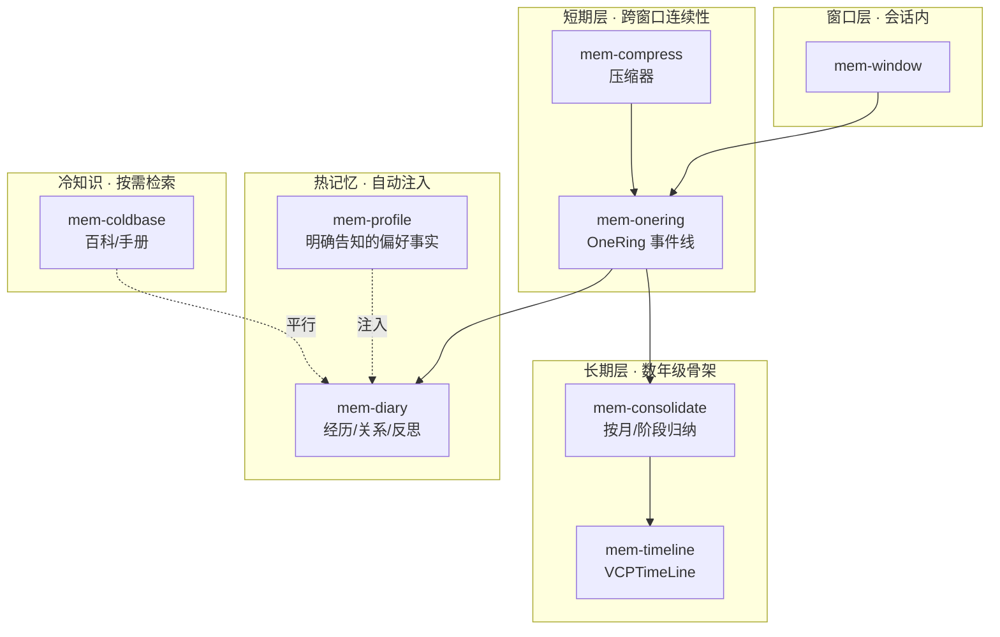
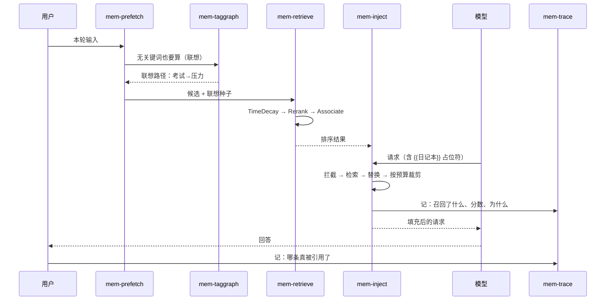

# 记忆域

> 17 个插件，构成一个**会自动浮现**的记忆系统。
> 核心原则：**记忆像引力一样主动流向 AI，不靠用户检索。**

## 1. 与核心的边界

| | 核心 | 记忆域 |
|---|---|---|
| 持有什么 | 当前对话的消息本身 | 消息**之外**的一切 |
| 做什么 | 跑对话循环 | 抽取、压缩、归纳、预取、注入、观测、控制 |

**窗口内的消息由核心的对话循环持有。** `mem-window` 管的是"怎么管"（显著性、压缩点、持久化），不是消息本身 —— 这是主核心单薄的边界。

## 2. 分层记忆



| 层 | 存什么 | 生命周期 | 谁写入 |
|---|---|---|---|
| **窗口** | 正在进行的对话 | 单会话 | 核心写入，本插件管理 |
| **档案** | 用户**明确告知**的偏好事实 | 长期，需确认 | `mem-extract` |
| **短期** | 近期消息压缩成的事件线 | 跨窗口 | `mem-compress` |
| **长期** | 按月归纳的阶段骨架 | 数年 | `mem-consolidate` |
| **热** | 经历、关系、反思 | 长期，高频检索 | `mem-extract` |
| **冷** | 百科、手册 | 长期，按需 | 外部导入 |

**存储与算法分开**是有意的：短期的"事件线"（`mem-onering`）和"压缩"（`mem-compress`）是两个插件，因为压缩可以换 —— 本地模型压、还是云端模型压，是两条不同的路。

## 3. 一轮对话里记忆怎么流动



**没有任何一步需要用户主动检索。** 用户不用问"你还记得吗"。

## 4. 三个关键机制

### 4.1 主动预取 —— 每轮都算

`mem-prefetch` 在每轮对话背后实时计算"**此时此刻 AI 应该知道什么**"。

| 要点 | 做法 |
|---|---|
| 无关键词匹配 | 走 `mem-taggraph` 的联想路径（考试 ↔ 压力） |
| 不阻塞 | 预取超时就不预取，**主对话不等** |
| 预算有限 | 只取高分，**明确说明取了几个、丢了几个** |
| 可解释 | 每条都说得出"为什么想起它" |

### 4.2 RAG 占位符注入

```ts
// 提示词里显式声明，不是隐式魔法
const prompt = `
用户最近的经历：{{日记本}}
他对本次问题的既有偏好：{{档案}}
`;
```

`mem-inject` 在生成前**拦截请求**，检索、替换、裁剪。

| 规则 | 为什么 |
|---|---|
| 占位符显式声明 | 隐式注入说不清注入了什么，也关不掉 |
| 超预算要**明示截断** | 悄悄少给 = 用户以为 AI 知道其实不知道 |
| 注入前过滤 | 未确认的健康/他人敏感信息不进 |
| 每个占位符可单独关 | 不同的整合包要不同的记忆面 |

### 4.3 检索后处理管线

`mem-retrieve` 的四级是**可独立开关**的，不是硬编码：

| 级 | 做什么 | 不可用时 |
|---|---|---|
| **TimeDecay** | 时间衰减 —— 越久越靠后，但不归零 | 跳过该级，记入埋点 |
| **Rerank** | 重排 —— 按与当前轮的相关性 | 退化为时间序 |
| **Associate** | 联想召回 —— 借标签网络拉进相关内容 | 跳过该级，记入埋点 |
| **Finalize** | 按 token 预算裁剪 | 返回 top-k，标注未完成 |

**跳过的级要记入埋点**，不静默 —— 检索质量下降时得能查出来是谁的锅。

## 5. 热冷分离

| | 热记忆 | 冷知识 |
|---|---|---|
| 是什么 | 个人经历、关系、反思 | 百科、手册、静态资料 |
| 检索时机 | **自动注入** | **按需检索** |
| 策略 | 每轮预取，高召回 | 查询命中才取 |
| 预算 | 独立配额 | 独立配额 |
| 会不会混 | **不会** | **不会** |

`mem-thermal` 负责路由。两层**平行运行**，不是二选一。结果**必须标明来自热还是冷** —— 把百科当个人经历讲是最糟的失败。

## 6. 记忆从哪来

**只从用户明确说的来。** `mem-extract` 抽取候选记忆，带置信度，交用户确认。

| 规则 | 为什么 |
|---|---|
| 不从行为反推 | 用户买了咖啡 ≠ 用户喜欢咖啡 |
| 高置信也不自动入库 | 除非用户开了自动模式 |
| 过敏忌口等高危信息**逐条确认** | 记错会出人命 |
| 误可否决并影响后续 | 用户纠正一次，之后就该记住 |

**冲突不静默覆盖**。`mem-reconcile` 判不了就并存标记 + 问用户；健康类事实冲突**必须问**。

## 7. 可观测性

`mem-trace` 接**核心的日志埋点**，不另开一套。

每轮记录：

| 记什么 | 为什么 |
|---|---|
| 召回了哪些记忆 | 知道 AI 脑子里有什么 |
| 为什么召回 | 能反查"它为什么想起这个" |
| 分数多少 | 调检索管线要用 |
| **是否真被引用** | 召回了 ≠ 用上了，这个差值是调优的关键信号 |

召回记录本身也是个人数据 —— 可导出、可删除、保留期受控。

## 8. 用户控制

**记忆不归系统所有。** `mem-console` 提供：

| 能力 | 说明 |
|---|---|
| 查看 | 按层、按标签、按时间筛 |
| 编辑 | 改完立刻影响后续注入 |
| 删除 | 可确认、备份期内可恢复，**明确告知备份期** |
| 导出 | 分片导出，中断不丢 |
| 状态管理 | 置信度、待确认、已确认、已过期 |
| 冲突解决 | 在控制台里直接选一个 |

控制台关掉，记忆系统照常工作 —— 只是不能手改。

## 9. 相关文档

- [../README.md](../README.md) — 全部 105 个插件
- [../../核心/开发文档.md](../../核心/开发文档.md) — 核心持有的对话与埋点
- [../../开发文档/11-设计理念与硬性约束.md](../../开发文档/11-设计理念与硬性约束.md) — 降级必须可见
