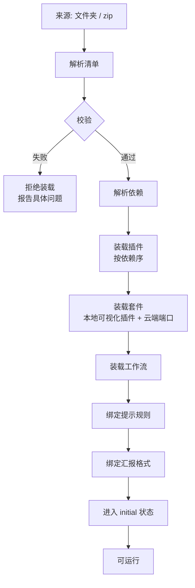
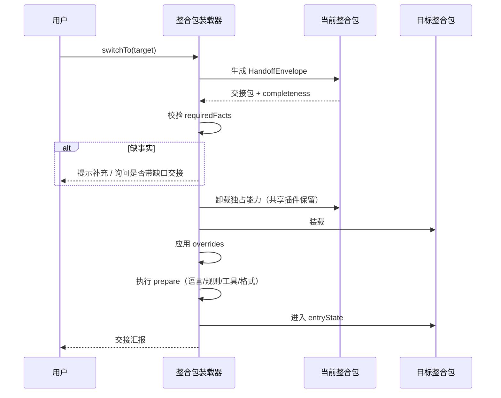

# 整合包：格式与装载器

> **本文是整合包机制的唯一规格文档。** 内容分两部分：
> 1. **整合包格式** —— 一个整合包长什么样（§1–§5）
> 2. **整合包装载器** —— 怎么装载、校验、切换、降级（§6–§9）
>
> **整合包不是内置的。** 系统不预置任何整合包。核心只提供装载能力。
> 具体整合包放在 [`示例/`](示例/README.md)，只需要写清楚由哪些插件完成。

---

## 一、整合包格式

### 1. 目录结构

一个整合包是一个独立文件夹：

```text
语音助手/
├── 开发文档.md          ← 必填。写清楚由什么插件完成
├── 清单.ts              ← IntegrationPackageManifest
├── 提示规则.md          ← promptPolicy 正文
├── 汇报格式.ts          ← reportFormat 定义
├── 状态机.ts            ← states + transitions
├── 提示规则/
│   ├── 默认.md
│   └── 澄清.md           ← 可拆分多个片段
└── 测试/
    ├── 装载.test.ts
    └── 交接.test.ts
```

| 文件 | 必填 | 说明 |
|---|---|---|
| `开发文档.md` | ✅ | 插件构成、状态、交接、降级 |
| `清单.ts` | ✅ | `IntegrationPackageManifest` 实现 |
| `提示规则.md` | ✅ | `promptPolicy` 引用的正文 |
| `汇报格式.ts` | ✅ | `reportFormat` 定义 |
| `状态机.ts` | ✅ | 状态、流转、验证 hook |
| `提示规则/` | ⬜ | 提示规则可拆成多个片段 |
| `测试/` | ⬜ | 装载、交接、状态流转的验证 |

### 2. 清单

```ts
import type { IntegrationPackageManifest } from "@core/types";

export const manifest: IntegrationPackageManifest = {
  id: "voice-assistant",              // 全局唯一
  name: "语音助手",
  version: "0.1.0",

  // 执行环境。切换时自动准备
  profile: {
    language: undefined,              // 入口型模式不指定语言
    framework: undefined,
    platform: "any",
    promptPolicy: "voice-assistant/default",     // 指向 提示规则/
    reportFormat: "voice-assistant/requirement-report",
    modelPolicy: {                            // 可选。见下
      transport: "api",                       // 入口型模式不跑外部 CLI
      byTaskKind: { "collect": ["claude-haiku"] },
    },
  },

  // 能力来源
  plugins: [ /* 见 §2.1 */ ],
  suites:  [ "model-suite" ],

  // 状态机
  states: ["讨论", "计划", "工作", "微调修正", "汇报"],

  // 交接。必填
  transitions: [ /* 见 §4 */ ],
};
```

#### 2.1 `plugins[]` 的三种写法

**写法 A —— 直接列插件（推荐，可读性最好）**

```ts
plugins: [
  "tts-out",
  "asr-local",
  "fs",
  "project-scan",
  "task-log",
  "goal-table",
]
```

**写法 B —— 按类别声明（解耦推荐）**

```ts
plugins: {
  // 需要哪一类能力，运行时按类别展开
  requireCategories: ["基础", "文档"],
  // 再显式指定几个
  require: ["asr-local", "tts-out"],
}
```

**写法 C —— 通配（谨慎）**

```ts
plugins: { require: ["office-*", "doc-*"] }   // 整类全要
```

> ⚠️ 写法 C 会让整合包随插件增删而行为改变，**不推荐用于正式整合包**。只在原型阶段用。

**写法 D —— 条件装载**

按沙箱强度、部署场景、用户开关决定装不装。**这是正式整合包的推荐形态**（A 的增强版）：

```ts
plugins: {
  require:   ["fs", "tool-write", "asr-local"],
  bySandbox: { "无": [], "进程级": ["sandbox-process"], "容器级": ["sandbox-container"] },
  byScenario:{ "默认": [], "内网高敏": ["workspace-sandbox"] },  // 机构内网 / 高敏场景
  optional:  ["asr-cloud"],                                  // 用户开开关才装
}
```

| 条件维度 | 取值 | 用途 |
|---|---|---|
| `bySandbox` | `无` / `进程级` / `容器级` | 沙箱强度不同，隔离插件不同 |
| `byScenario` | 任意场景名 | 部署场景不同（例：`内网高敏` = 机构内网、敏感数据不出网） |
| `optional` | 插件 id 列表 | 用户显式开关才装，不影响整合包启动 |

**条件不满足时的行为**：该插件不装载，能力标记为 `degraded` 并**记入日志埋点**，整合包仍可启动（见 [§7](#7-装载流程)）。

#### 2.2 `suites[]`

云端套件。每个套件在本地有一个可视化插件（见 [05](../开发文档/05-云端套件双体结构.md)）。

```ts
suites: [
  "model-suite",                    // 提供 model.suite 能力
  "collaboration-suite",            // 可选
]
```

**整合包只声明能力，不声明供应商。**

#### 2.3 `profile.modelPolicy` —— 想要什么模型，不指定账号

```ts
modelPolicy?: {
  /** 任务类别 → 想要的模型，按优先级 */
  byTaskKind?: Record<string, string[]>;
  /** 走 API 还是走外部 CLI。auto 交给 target-resolve */
  transport?: "api" | "cli" | "auto";
};
```

**这里写的是模型名，不是账号 id。** 「整合包只声明能力，不声明供应商」这条原则正是这么落的 —— 写账号 id 会直接违反它。

两级的关系：

```text
整合包 profile.modelPolicy   →  要什么模型（能力）
全局 ModelSelectionPolicy    →  用哪个账号满足它（配置）
```

包换账号不用改，符合可替换。**这也是 `Target.decidedBy: "profile"` 的着落** —— 没有这个字段，解析链第 ② 级无处落地。

| 谁 | 定什么 | 改动频率 |
|---|---|---|
| 整合包 `modelPolicy` | 什么模型适合干什么 | 偶尔 |
| 全局 `ModelSelectionPolicy` | 哪个账号满足它 | 经常（切便宜/切强的） |
| [../开发文档/10-工作台与项目管理.md](../开发文档/10-工作台与项目管理.md) 账号 | 端点、凭据、限流 | 很少 |

**`transport: "cli"` 要谨慎。** 走 CLI 意味着有个外部程序在跑，它自带 agent 循环和文件访问，**难埋点、结果要解析**。包要这么声明，说明它信任那个 CLI 的 harness 已经调好了。

### 3. 状态机

#### 3.1 标准五态

```text
讨论 → 计划 → 工作 → 微调修正 → 汇报
```

| 状态 | 语义 | 允许的流转 |
|---|---|---|
| **讨论** | 澄清、提问、收信息 | → 计划 |
| **计划** | 拆任务、定验证方式、建工作区 | → 工作；→ 讨论（信息不足） |
| **工作** | 执行、验证 | → 微调修正（验证失败）；→ 汇报（全部通过） |
| **微调修正** | 修正问题 | → 工作（修完再验） |
| **汇报** | 公文式汇总 | → 交接（触发 transitions） |

**状态可回退**（工作 → 计划），**任务可并行**（多个任务同时处于工作态）。

#### 3.2 状态定义

```ts
export const stateMachine: PackageStateMachine = {
  id: "voice-assistant",
  initial: "讨论",
  states: {
    "讨论": {
      on: { CLARIFIED: "计划", NEED_INFO: "讨论" },
      hooks: [{ phase: "after", validator: "术语清洗" }],
    },
    "计划": {
      on: { APPROVED: "工作", INSUFFICIENT: "讨论" },
      // 勾选即批准 → 自动新建子智能体，不切模式
      hooks: [{ phase: "after", validator: "任务可执行性" }],
      onApprove: "spawn-subagent",
    },
    "工作": {
      on: { VERIFY_FAILED: "微调修正", ALL_PASS: "汇报" },
      parallel: true,                 // 允许并行任务
    },
    "微调修正": { on: { FIXED: "工作" } },
    "汇报":   { on: { HANDOFF: "__exit__" } },
  },
  onFailure: "degrade",               // abort | retry | degrade | handoff
};
```

#### 3.3 验证 hook

每个关键节点可挂验证器，验证器由**插件**提供（如 `build-test` 提供 `verify.build`）。

```ts
hooks: [
  { at: { state: "工作", phase: "after" }, validator: "build-test:verify.typecheck" },
  { at: { state: "工作", phase: "after" }, validator: "build-test:verify.test" },
]
```

**验证失败不中断**，按 `onFailure` 处理：默认 `degrade`（降级到微调修正态）。

### 4. 交接声明

**`transitions` 是必填项。** 没有交接声明的整合包视为未完成。

```ts
transitions: [
  {
    targetPackageId: "code-development",
    trigger: "完成条件",              // manual | 完成条件 | 建议交接
    requiredFacts: ["objective", "projectId", "decisions"],
    handoffMapping: {
      "task.objective":              "task.objective",
      "task.constraints":            "task.constraints",
      "task.decisions":              "task.decisions",
      "task.openQuestions":          "task.openQuestions",
      "history.conversationRef":     "history.conversationRef",
      "history.artifactRefs":        "history.artifactRefs",
    },
    prepare: [
      { kind: "language",     value: "typescript" },
      { kind: "framework",    value: "react" },
      { kind: "promptRules",  value: "code-development/default" },
      { kind: "reportFormat", value: "code-development/change-report" },
    ],
  },
]
```

| 字段 | 必填 | 说明 |
|---|---|---|
| `targetPackageId` | ✅ | 目标整合包 |
| `trigger` | ✅ | `manual` / `完成条件` / `建议交接` |
| `requiredFacts` | ✅ | 必需事实。缺失则不允许交接 |
| `handoffMapping` | ✅ | 字段映射：源 → 目标 |
| `prepare` | ⬜ | 目标包自动准备什么。不填则用目标包默认值 |

**三种触发的行为**：

| 触发 | 是否阻塞 | 说明 |
|---|---|---|
| `manual` | 不阻塞 | 用户随时可切 |
| `完成条件` | **满足前禁止** | `requiredFacts` 必须齐 |
| `建议交接` | 不阻塞 | 运行时判断建议切，只提示 |

### 5. 提示规则与汇报格式

#### 5.1 提示规则

`profile.promptPolicy` 是一个**字符串引用**，指向 `提示规则/` 下的文件：

```ts
promptPolicy: "voice-assistant/default"     // → 提示规则/默认.md
promptPolicy: "voice-assistant/*"            // → 提示规则/ 下全部片段
```

**规则片段可组合**。多个 skill / 套件也可以贡献片段，最终按整合包规则拼装（见 [03 §1](../开发文档/03-装载器与a2a规范.md)）。

#### 5.2 汇报格式

```ts
export const reportFormat: ReportFormat = {
  id: "voice-assistant/requirement-report",
  sections: [
    { key: "completed", title: "完成了什么",     required: true },
    { key: "issues",    title: "存在什么问题",   required: true },
    { key: "decisions", title: "需要我做什么决策", required: true },
    { key: "nextSteps", title: "还缺什么",       required: false },
  ],
  requireEvidence: false,
  outputFormat: "markdown",
};
```

**`completed` / `issues` / `decisions` 三段恒为必填**，可加段不可减段（见 [11 §2](../开发文档/11-设计理念与硬性约束.md)）。

---

## 二、整合包装载器

### 6. 装载器职责

装载器**不认识**整合包的具体内容，只负责把一个声明变成可运行的装配。

```ts
interface PackageLoader {
  /** 从文件夹或 zip 装载 */
  load(source: PackageSource, ctx: LoadContext): Promise<PackageLoadResult>;
  /** 热切换：卸载当前 + 装载目标 */
  switchTo(packageId: string, handoff?: HandoffEnvelope): Promise<SwitchResult>;
  /** 校验。不实际装载 */
  validate(source: PackageSource): Promise<ValidationReport>;
  healthCheck(packageId: string): Promise<HealthReport>;
  unload(packageId: string): Promise<void>;
  list(): PackageInfo[];
}
```

### 7. 装载流程



**九个步骤**，每步失败都有明确处理：

| 步骤 | 失败处理 |
|---|---|
| 解析清单 | 拒绝装载 |
| 校验 | 拒绝装载，列出全部问题（不是只报第一个） |
| 解析依赖 | 缺依赖 → 该能力标 `degraded`，整合包仍可启动 |
| 装载插件 | 插件失败 → 该能力缺失，**不整体失败** |
| 装载套件 | 云端端口不可用 → 按 `degradation.offline` 降级 |
| 装载工作流 | 工作流失败 → 标 `degraded` |
| 绑定提示规则 | 缺规则 → 用内置兜底并告警 |
| 绑定汇报格式 | 缺格式 → 用核心默认三段式并告警 |
| 进入初始状态 | — |

### 8. 校验规则

`validate()` 检查以下项，**全部问题一次报全**：

| 检查 | 失败级别 | 说明 |
|---|---|---|
| 清单可解析 | 错误 | TS 能编译、`manifest` 已导出 |
| `id` 唯一 | 错误 | 不与已装载的冲突 |
| `id` 格式合法 | 错误 | 小写 + 连字符 |
| `states` 非空且有 `initial` | 错误 | |
| `transitions` 非空 | 错误 | **没有交接声明 = 未完成** |
| `transitions` 的 `targetPackageId` 存在 | 警告 | 目标未安装则无法交接 |
| `requiredFacts` 都在交接包 schema 内 | 错误 | 拼错的事实名 |
| `handoffMapping` 字段存在于源包 | 错误 | 映射源字段拼错 |
| `plugins[]` 能解析到已注册插件 | 警告 | 找不到的列为 `denied` |
| `suites[]` 能解析 | 警告 | |
| `profile.promptPolicy` 指向的文件存在 | 警告 | |
| `profile.reportFormat` 已定义 | 警告 | |
| 权限请求在允许范围内 | 错误 | 申请了拿不到的权限 |

**错误 → 拒绝装载。警告 → 装载但记入日志埋点，并在首次使用时提示。**

### 9. 热切换

切换**不是重启**，是带交接的换装配。



#### 9.1 共享插件不卸载

```ts
// 引用计数
const refCount: Map<string, number> = new Map();
```

- 切换整合包时，**只有引用计数归零的插件才真正卸载**
- 共享插件（如 `fs`）保持热状态，切换后立即可用
- 独占插件（如 `asr-local` 只在语音助手用）被卸载

#### 9.2 切换失败回滚

```ts
switchTo(target) {
  const rollback = snapshot(current);
  try {
    unloadExclusive(current);
    load(target);
    applyPrepare(target, handoff);
  } catch (e) {
    rollback.restore();              // 恢复原整合包
    return { ok: false, error: e, rolledBackTo: current.id };
  }
}
```

**切换失败必须回滚到原整合包**，不留半装配状态。

### 10. 打包与分发

整合包可打包为 zip：

```text
语音助手-0.1.0.zip
├── 清单.ts
├── 开发文档.md
├── 提示规则/
├── 汇报格式.ts
├── 状态机.ts
└── package.json
```

zip 放在 [`打包/`](打包/README.md)。装载器从文件夹或 zip 装载，**两者等价**。

**插件**同样可打包为 zip 放入 `打包/`。

---

## 三、示例

具体整合包放在 [`示例/`](示例/README.md)：

| 整合包 | 用途 |
|---|---|
| [语音助手](示例/语音助手/开发文档.md) | 收集需求、澄清、记录决策 |
| [代码开发](示例/代码开发/开发文档.md) | 计划、修改、测试、汇报 |
| [项目监测](示例/项目监测/开发文档.md) | 状态跟踪、异常发现、汇报 |
| [设计转代码](示例/设计转代码/开发文档.md) | 设计稿到可用页面 |
| [个人助理](示例/个人助理/开发文档.md) | 记住偏好与长期目标，到点提醒 |

**每个示例只需要写清楚由哪些插件完成**，不需要重复本文的格式定义。

## 相关文档

- [04-三大核心对象](../开发文档/04-三大核心对象.md) — 整合包契约的类型定义
- [06-模式衔接与交接协议](../开发文档/06-模式衔接与交接协议.md) — 交接包结构与流转
- [11-设计理念与硬性约束](../开发文档/11-设计理念与硬性约束.md) — 汇报三段式、提示规则、状态约束
- [12-TypeScript接口契约](../开发文档/12-TypeScript接口契约.md) — 完整类型定义
- [../插件/README.md](../插件/README.md) — 全部 105 个插件
