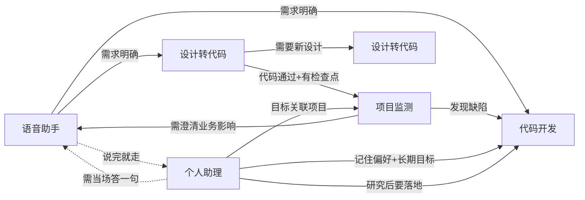

# 整合包示例

> 具体整合包放在这里。**整合包不是内置的** —— 这里的五个是示例，用不上直接删文件夹。
>
> 每个示例只需要写清楚**由哪些插件完成**。格式定义见 [../开发文档.md](../开发文档.md)。

## 目录约定

```text
整合包/
├── 开发文档.md          ← 格式定义 + 装载器规格（唯一一份）
├── 示例/                ← 具体整合包
│   ├── README.md        ← 本文件
│   ├── 语音助手/
│   │   └── 开发文档.md  ← 插件构成、状态、交接、汇报、降级
│   ├── 代码开发/
│   ├── 项目监测/
│   ├── 设计转代码/
│   └── 个人助理/
└── 打包/                ← 打包成 zip 的整合包 / 插件放这里
```

## 五个示例

| 整合包 | 定位 | 核心插件 |
|---|---|---|
| [语音助手](语音助手/开发文档.md) | **入口型** —— 产出清楚的需求 | 语音四件套 + 文档三件套 |
| [代码开发](代码开发/开发文档.md) | **主力型** —— 产出可验证的代码 | 基础工具链 + 工作空间 + 工具生态 |
| [项目监测](项目监测/开发文档.md) | **观察型** —— 产出问题清单 | 构建测试 + 远程分析 + 工具执行 |
| [设计转代码](设计转代码/开发文档.md) | **实现型** —— 产出可用页面 | 知识库套件 + 截屏框选 + 构建 |
| [个人助理](个人助理/开发文档.md) | **沉淀型** —— 记住你是谁，要点前提醒 | 记忆 17 件 + 目标 6 件 + 执行面 |

## 模式之间的衔接



前四个是**用户发起**，个人助理是**系统主动** —— 它的大部分时间在后台守候，不在对话里。

每个示例的"交接"一节写明 `requiredFacts` 和 `prepare`，见 [../开发文档.md §4](../开发文档.md)。

## 新增一个整合包

1. `cp -r 示例/语音助手 示例/你的整合包名`
2. 改 `清单.ts` 的 `id`、`name`、`plugins[]`
3. 写 `开发文档.md`：**由哪些插件完成**
4. 写 `提示规则/`
5. 声明 `transitions`（**必填**）
6. 跑装载器 `validate()`，警告清零

不需要动的：格式定义、装载器 —— 都在 [../开发文档.md](../开发文档.md)。
